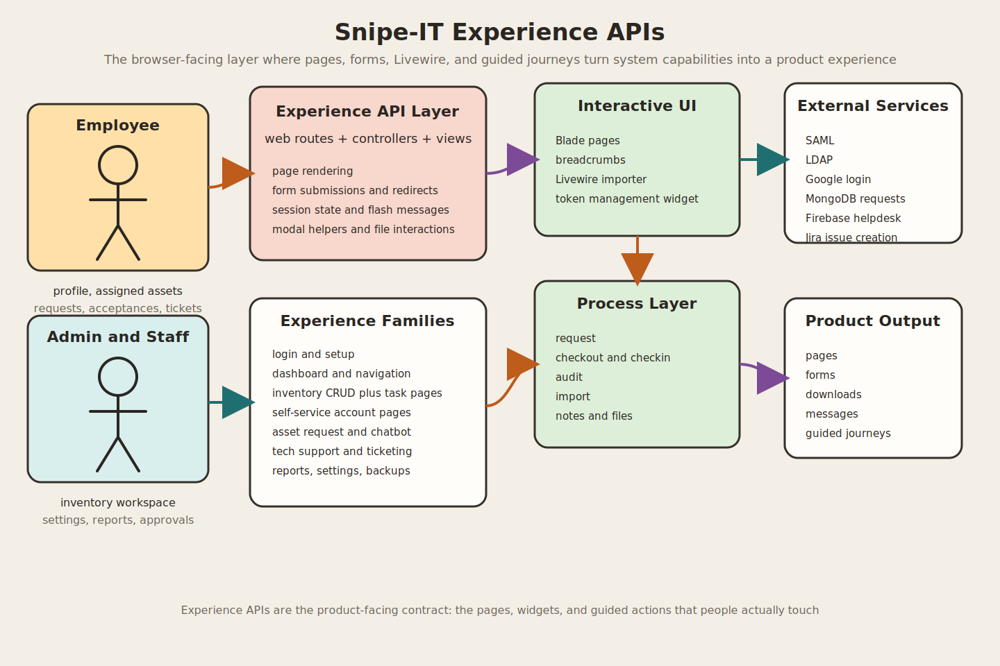

# Experience APIs

This document describes the experience-facing API layer of this Snipe-IT project. If `system-apis.md` explains the platform surface and `process-apis.md` explains the workflow verbs, this page explains how the application turns those capabilities into real user journeys, screens, forms, and interactive UI behaviors.

## 1. What "Experience APIs" mean here

In this project, Experience APIs are the browser-facing endpoints and UI interaction contracts that shape how people actually use the system.

They include:

- web routes that render pages
- form submission endpoints that redirect with session messages
- modal and helper endpoints used by the interface
- Livewire-driven interactive screens
- self-service pages for profiles, inventory, and requests
- admin settings, reports, and operational pages
- custom experience flows such as asset requests, chat assistance, and tech support

Unlike the REST API, this layer is not mainly about stable machine-to-machine integration. It is about delivering product behavior to humans through the browser.

## 2. Relationship to the other layers

The three documentation layers in this repo can be read like this:

| Layer | Main question | Main delivery style |
| --- | --- | --- |
| System APIs | What interfaces exist? | REST routes, SCIM routes, controller surface |
| Process APIs | How does work move through the system? | Lifecycle actions such as request, checkout, audit, import |
| Experience APIs | How do users experience those capabilities? | Pages, forms, redirects, session state, UI widgets, interactive views |

In practice, the Experience API layer sits on top of the other two:

1. A user opens a page route.
2. The server renders a view or interactive component.
3. The user triggers a form or action endpoint.
4. The controller coordinates process logic and persistence.
5. The UI responds with a redirect, flash message, updated page, download, or JSON snippet.

## 3. Delivery model and frontend stack

This application uses a server-rendered Laravel experience model rather than a standalone SPA.

### 3.1 Experience delivery style

- Blade views are the primary page delivery mechanism.
- Resource controllers provide the standard CRUD screens.
- Task-specific routes handle checkout, checkin, approval, cloning, reporting, and exports.
- Livewire is used for richer interactive screens such as the importer and personal access token management.
- Small JSON responses are used selectively for experience helpers such as the asset chatbot.

### 3.2 Web middleware shaping the experience

The `web` middleware group is part of the experience contract because it controls how the UI behaves.

Important behavior includes:

- cookies and sessions
- CSRF protection
- locale handling
- activated-user checks
- two-factor checks
- fresh API token creation for the web app
- sidebar asset counts
- color and theme settings
- authenticated session handling
- route model binding

### 3.3 UI stack signals from the codebase

The frontend package setup and interactive code suggest a classic Laravel admin UI stack:

- AdminLTE
- Bootstrap 3
- jQuery
- Select2
- bootstrap-table
- Chart.js
- Livewire
- Laravel Mix

This means the Experience API layer is a mix of full-page navigation, enhanced forms, modal dialogs, table widgets, and progressive interactivity rather than an API-only frontend shell.

## 4. Core experience families

### 4.1 Entry, setup, and authentication experience

Purpose:
Get the system installed, let users sign in, and protect access with the right authentication flow.

Main routes:

- `GET /setup`
- `GET /setup/user`
- `POST /setup/user`
- `POST /setup/migrate`
- `GET /setup/done`
- `GET /login`
- `POST /login`
- `GET /two-factor-enroll`
- `GET /two-factor`
- `POST /two-factor`
- `GET /password/reset`
- `POST /password/email`
- `GET /password/reset/{token}`
- `POST /password/reset`
- `GET /google`
- `GET /google/callback`
- `GET /logout`
- `POST /logout`

Experience notes:

- The setup flow validates environment readiness, database connectivity, writable storage, and exposed `.env` risk before creating the first admin.
- Login supports local auth and also contains SAML, LDAP, remote-user, Google, and two-factor experience paths.
- The login screen can be bypassed or forced into SAML depending on configuration.
- Password-reset routes are throttled to protect the recovery experience.

### 4.2 Home dashboard and navigation experience

Purpose:
Give each signed-in user an appropriate landing page and preserve UI state.

Main routes:

- `GET /`
- `GET /account/menu`
- `GET /modals/{type}/{itemId?}`
- `GET /health`

Experience notes:

- `DashboardController@index` sends admins to the dashboard view and redirects non-admin users toward their self-service asset view.
- The menu state endpoint persists open or closed sidebar behavior in session state.
- The modal route group provides reusable dialog content for in-context creation and editing flows.
- The health route is intentionally outside normal web middleware and acts as an infrastructure-facing experience endpoint.

### 4.3 Inventory workspace experience

Purpose:
Provide the core admin workspace for managing inventory objects through pages, forms, and task-specific actions.

Primary resource screen families:

- `hardware`
- `accessories`
- `components`
- `consumables`
- `licenses`
- `models`
- `users`
- `companies`
- `categories`
- `manufacturers`
- `suppliers`
- `departments`
- `locations`
- `kits`
- `maintenances`
- `statuslabels`
- `depreciations`
- `groups`

Common experience patterns across these routes:

- resource index, create, edit, show, and delete pages
- checkout and checkin forms
- clone screens
- bulk edit, bulk delete, bulk restore, and bulk checkout actions
- export, print, and label-generation screens
- QR code and barcode views
- route breadcrumbs for orientation inside deep workflows

Representative task routes:

- `GET /hardware/{asset}/checkout`
- `POST /hardware/{assetId}/checkout`
- `GET /hardware/{asset}/checkin/{backto?}`
- `POST /hardware/{assetId}/checkin/{backto?}`
- `GET /hardware/bulkaudit`
- `GET /hardware/quickscancheckin`
- `GET /hardware/{asset}/qr_code`
- `GET /hardware/{asset}/barcode`
- `GET /accessories/{accessoryID}/checkout`
- `GET /components/{componentID}/checkout`
- `GET /licenses/{license}/checkout/{seatId?}`
- `GET /users/export`
- `GET /users/{userId}/print`

Experience notes:

- The route design is page-first: users are usually taken to a form page before an action is submitted.
- Inventory experiences are optimized for operators doing repeated admin work rather than for headless automation.
- Resource-specific route files keep each domain's interaction model close to its CRUD screens.

### 4.4 Self-service account experience

Purpose:
Let end users manage their identity, view their assigned items, request inventory, and handle acceptance-related tasks.

Main routes:

- `GET /account`
- `GET /account/profile`
- `POST /account/profile`
- `GET /account/password`
- `POST /account/password`
- `GET /account/api`
- `GET /account/view-assets`
- `GET /account/requested`
- `GET /account/requestable-assets`
- `POST /account/request-asset/{asset}`
- `POST /account/request-asset/{asset}/cancel`
- `GET /account/accept`
- `GET /account/accept/{id}`
- `POST /account/accept/{id}`
- `GET /account/print`
- `POST /account/email`

Experience notes:

- Users can update personal details, sounds, confetti, colors, locale, avatar, location, and optional two-factor opt-in.
- The API key management page is a self-service experience backed by token creation and deletion logic.
- Assigned inventory is presented as a user-facing dashboard rather than an admin list.
- If `manager_view_enabled` is on, managers can switch the self-service inventory view to inspect subordinate users.
- Acceptance flows and inventory print/email actions are part of the user ownership experience rather than the admin workspace.

### 4.5 Asset request and assistant experience

Purpose:
Provide a guided request journey for employees, approvers, superusers, and technical support.

Main routes:

- `GET /assetRequest`
- `POST /assetRequest`
- `GET /assetRequest/status`
- `GET /assetRequest/approve`
- `POST /assetRequest/approve/{requestId}`
- `GET /assetRequest/asset-specification`
- `GET /assetRequest/asset-specification/{requestId}`
- `POST /assetRequest/asset-specification/{requestId}`
- `POST /assetRequest/asset-specification/{requestId}/deploy`
- `GET /assetRequest/assets-approved`
- `GET /assetRequest/assignaApprover`
- `POST /assetRequest/assignaApprover`
- `GET /assetRequest/assignTechnicalSupport`
- `POST /assetRequest/assignTechnicalSupport`
- `GET /assetRequest/chatbot`
- `POST /assetRequest/chatbot/ask`

Experience notes:

- This is a custom, multi-stage experience beyond the stock Snipe-IT flows.
- Asset requests are stored through MongoDB-backed services.
- The journey includes submission, approval, approver assignment, technical support assignment, specification drafting, and deployment tagging.
- The chatbot route adds an assistant-style micro-experience for asset questions.
- Permissions shape which users see approval, assignment, and technical-support-specific pages.

### 4.6 Tech support and ticketing experience

Purpose:
Give users and support staff a support-desk style workflow inside the app.

Main routes:

- `GET /tech-support/request-ticket`
- `POST /tech-support/request-ticket`
- `GET /tech-support/ticket-status`
- `GET /tech-support/approve-ticket`
- `POST /tech-support/approve-ticket/{ticketId}`
- `GET /tech-support/jira-diagnostics`
- `GET /tech-support/resolve-ticket`
- `POST /tech-support/resolve-ticket/{ticketId}`

Experience notes:

- Ticket requests are saved to Firebase through the `FirebaseHelpdeskService`.
- Approved tickets can create Jira issues through the `JiraIssueService`.
- The experience is split into requester, approver, diagnostic, status-tracking, and resolver views.
- This is another custom product experience layered into the app alongside the inventory system.

### 4.7 Importer experience

Purpose:
Provide an interactive bulk-import UI rather than only a raw upload endpoint.

Main routes and components:

- `GET /import`
- `GET /import/download/{import}`
- `App\Livewire\Importer`

Experience notes:

- The importer is a Livewire experience, not just a simple file form.
- It supports import type selection, field mapping, alias matching, preview rows, backup options, and status messaging.
- This turns the Process API import flow into a guided browser workflow suitable for administrators.

### 4.8 Reporting and export experience

Purpose:
Make operational, audit, and management reporting available as navigable screens and downloadable outputs.

Main routes:

- `GET /reports/audit`
- `GET /reports/depreciation`
- `GET /reports/maintenances`
- `GET /reports/licenses`
- `GET /reports/accessories`
- `GET /reports/custom`
- `POST /reports/custom`
- `GET /reports/activity`
- `POST /reports/activity`
- `GET /reports/unaccepted_assets/{deleted?}`
- `POST /reports/unaccepted_assets/{deleted?}`
- `POST /reports/unaccepted_assets/sent_reminder`
- `DELETE /reports/unaccepted_assets/{acceptanceId}/delete`

Report-template experience routes:

- `POST /reports/templates`
- `GET /reports/templates/{reportTemplate}`
- `GET /reports/templates/{reportTemplate}/edit`
- `POST /reports/templates/{reportTemplate}`
- `DELETE /reports/templates/{reportTemplate}`

Experience notes:

- Reports are treated as browseable UI products, not only export utilities.
- Breadcrumbs are heavily used to orient users inside reporting and template-customization flows.
- Export actions live alongside their visual report pages.

### 4.9 Admin configuration experience

Purpose:
Expose superuser-only configuration pages for system behavior, branding, auth, and operations.

Main route family:

- `/admin/*`

Primary settings pages:

- `/admin/settings`
- `/admin/branding`
- `/admin/security`
- `/admin/localization`
- `/admin/notifications`
- `/admin/slack`
- `/admin/asset_tags`
- `/admin/labels`
- `/admin/ldap`
- `/admin/phpinfo`
- `/admin/oauth`
- `/admin/google`
- `/admin/purge`
- `/admin/login-attempts`
- `/admin/saml`
- `/admin/backups`

Experience notes:

- This section functions like an internal control center for the product.
- Backup management is a full UI flow with create, download, upload, restore, and delete actions.
- OAuth, Google login, LDAP, and SAML settings make authentication part of the admin experience rather than only an infrastructure concern.
- Branding and color settings directly affect the look and feel of the whole experience layer.

### 4.10 Supporting interaction endpoints

Purpose:
Support page-level interactions that are shared across multiple experiences.

Main routes:

- `POST /notes`
- `GET /display-sig/{filename}`
- `GET /stored-eula-file/{filename}`
- `GET /account/display-sig/{filename}`
- `GET /account/stored-eula-file/{filename}`
- `GET /{object_type}/{id}/files/{file_id}`
- `POST /{object_type}/{id}/files`
- `DELETE /{object_type}/{id}/files/{file_id}/delete`
- `GET /labels/{labelName}`

Experience notes:

- Notes, signatures, stored EULAs, and uploaded files are supporting experience APIs that enrich ownership, approval, maintenance, and audit views.
- These routes are not standalone products, but they are important pieces of how the full experience feels and behaves.

## 5. End-to-end experience examples

### 5.1 New user sign-in experience

1. User reaches `GET /login`
2. The system may redirect into SAML, Google, or remote-user flows depending on configuration
3. User completes login and possibly two-factor
4. User lands on `/`
5. Admins see the dashboard, while non-admins are redirected to self-service inventory

### 5.2 Employee inventory self-service experience

1. User opens `GET /account/view-assets`
2. The page shows assigned assets, licenses, accessories, and consumables
3. User navigates to `GET /account/requestable-assets`
4. User submits `POST /account/request-asset/{asset}`
5. User reviews status through `GET /account/requested`

### 5.3 Asset request approval-to-deployment experience

1. Employee submits `POST /assetRequest`
2. Approver reviews items on `GET /assetRequest/approve`
3. Approval is recorded via `POST /assetRequest/approve/{requestId}`
4. Technical support opens `GET /assetRequest/asset-specification/{requestId}`
5. Specification is saved and later tagged deployed

### 5.4 Tech support ticket experience

1. User submits `POST /tech-support/request-ticket`
2. Approver reviews via `GET /tech-support/approve-ticket`
3. Approval creates or links Jira work
4. Requester and staff monitor `GET /tech-support/ticket-status`
5. Resolver closes via `POST /tech-support/resolve-ticket/{ticketId}`

### 5.5 Admin bulk-import experience

1. Admin opens `GET /import`
2. Livewire importer captures file and column mapping
3. The underlying import process is triggered and tracked
4. Admin reviews results and downloads any needed artifacts

## 6. Design observations from the code

- The app is strongly page-oriented rather than SPA-oriented.
- Resource controllers define the base workspace, while custom routes define the richer experience verbs.
- Session state, redirects, breadcrumbs, and flash messages are core parts of the experience contract.
- Livewire is used selectively where the UX needs more interactivity without moving to a full frontend framework.
- The experience layer integrates several external systems beyond Laravel itself, including MongoDB-backed request services, Firebase-backed helpdesk storage, Jira issue creation, SAML, LDAP, and Google login.
- Experience routes frequently express intent in UI language such as `approve`, `resolve-ticket`, `requestable-assets`, `bulkcheckout`, `jira-diagnostics`, and `asset-specification`.

## 7. Source of truth

The main source files behind this experience layer are:

- `routes/web.php`
- `routes/web/hardware.php`
- `routes/web/users.php`
- `routes/web/licenses.php`
- `routes/web/accessories.php`
- `routes/web/components.php`
- `routes/web/consumables.php`
- `routes/web/models.php`
- `app/Http/Kernel.php`
- `app/Http/Controllers/DashboardController.php`
- `app/Http/Controllers/ProfileController.php`
- `app/Http/Controllers/ViewAssetsController.php`
- `app/Http/Controllers/SettingsController.php`
- `app/Http/Controllers/SetupController.php`
- `app/Http/Controllers/Auth/LoginController.php`
- `app/Http/Controllers/Account/AssetRequestController.php`
- `app/Http/Controllers/Account/AssetChatbotController.php`
- `app/Http/Controllers/Account/TechSupportController.php`
- `app/Livewire/Importer.php`
- `app/Livewire/PersonalAccessTokens.php`

