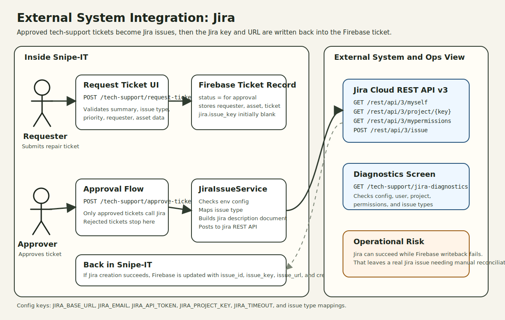

# External System Integrations: Jira

This document describes the Jira integration implemented in this project. It focuses on the approval-to-issue flow used by the custom tech-support feature, the local configuration points, the Jira REST calls, and the failure modes that matter in operations.

## 1. Integration purpose

In this project, Jira is used as an external work-management system for approved tech-support repair tickets.

The integration does not create Jira issues at initial submission time.

Instead, the flow is:

1. A requester submits a tech-support ticket.
2. The ticket is stored in Firebase.
3. A technical-support approver reviews the ticket in Snipe-IT.
4. If the ticket is approved, Snipe-IT creates a Jira issue through the Jira REST API.
5. The created Jira metadata is written back into the Firebase ticket record.

## 2. Integration summary

| Aspect | Detail |
| --- | --- |
| Integration name | Jira issue creation for tech-support repair tickets |
| Direction | Outbound from Snipe-IT to Jira |
| Trigger | Approval of a repair ticket in `TechSupportController@reviewTicket` |
| Local service owner | `App\Services\JiraIssueService` |
| External API style | Jira Cloud REST API v3 |
| Authentication | Basic auth with Jira email + Jira API token |
| Primary local dependency | Firebase helpdesk ticket storage |
| Returned external identifiers | `issue_id`, `issue_key`, `issue_url`, `created_at` |
| Local UI surfaces | approve ticket, ticket status, resolve ticket, Jira diagnostics |

## 3. Local integration entry points

| Local route or code path | Purpose | Jira involvement |
| --- | --- | --- |
| `POST /tech-support/approve-ticket/{ticketId}` | Approve or reject a tech-support ticket | Creates a Jira issue only when approval status is `approved` |
| `GET /tech-support/jira-diagnostics` | Check Jira connectivity and permissions | Calls Jira diagnostic endpoints through `JiraIssueService::diagnostics()` |
| `GET /tech-support/ticket-status` | Show ticket progress | Displays stored Jira key and URL after issue creation |
| `GET /tech-support/resolve-ticket` | Work approved tickets toward closure | Displays stored Jira issue metadata |

Related local classes:

| Class | Responsibility |
| --- | --- |
| `App\Http\Controllers\Account\TechSupportController` | UI workflow, approval logic, Firebase coordination |
| `App\Services\JiraIssueService` | Jira config validation, diagnostics, issue creation |
| `App\Services\FirebaseHelpdeskService` | Persists the originating ticket and later stores Jira metadata back onto it |

## 4. Configuration model

The Jira integration is configured through `config/services.php`, which reads from environment variables.

| Env var | Config key | Required | Purpose |
| --- | --- | --- | --- |
| `JIRA_BASE_URL` | `services.jira.base_url` | Yes | Base Jira URL such as `https://example.atlassian.net` |
| `JIRA_EMAIL` | `services.jira.email` | Yes | Jira account email used for API authentication |
| `JIRA_API_TOKEN` | `services.jira.api_token` | Yes | Jira API token used with the email |
| `JIRA_PROJECT_KEY` | `services.jira.project_key` | Yes | Jira project key used for issue creation |
| `JIRA_TIMEOUT` | `services.jira.timeout` | No | HTTP timeout in seconds, default `30` |
| `JIRA_ISSUE_TYPE_TASK` | `services.jira.issue_types.Task` | No | Maps local `Task` selection to a Jira issue type name |
| `JIRA_ISSUE_TYPE_BUG` | `services.jira.issue_types.Bug` | No | Maps local `Bug` selection to a Jira issue type name |
| `JIRA_ISSUE_TYPE_INCIDENT` | `services.jira.issue_types.Incident` | No | Maps local `Incident` selection to a Jira issue type name |
| `JIRA_ISSUE_TYPE_SERVICE_REQUEST` | `services.jira.issue_types.Service Request` | No | Maps local `Service Request` selection to a Jira issue type name |

Important behavior:

| Behavior | Detail |
| --- | --- |
| Missing required config | `JiraIssueService` throws a `RuntimeException` with a specific setup message |
| Issue-type mapping | Local UI values can be remapped to different Jira issue type names through env config |
| Token exposure | Diagnostics intentionally reveal safe config values like base URL, email, and project key, but not the API token |

## 5. Supported ticket inputs that feed Jira

The local request form validates and stores the fields below before approval.

| Local field | Required | Used in Jira issue creation |
| --- | --- | --- |
| `requester_name` | Yes | Included in Jira description |
| `requester_email` | Yes | Included in Jira description |
| `department` | No | Included in Jira description |
| `contact_number` | No | Included in Jira description |
| `item_name` | Yes | Included in Jira description |
| `asset_tag` | No | Included in Jira description |
| `serial_number` | No | Included in Jira description |
| `location` | No | Included in Jira description |
| `issue_category` | Yes | Included in Jira description |
| `jira_issue_type` | Yes | Used to determine Jira `issuetype.name` |
| `priority` | Yes | Included in Jira description |
| `summary` | Yes | Used as Jira `summary` |
| `description` | Yes | Expanded into the Jira description document |

Allowed local `jira_issue_type` values:

| Value |
| --- |
| `Task` |
| `Bug` |
| `Incident` |
| `Service Request` |

## 6. External Jira API calls

### 6.1 Diagnostic calls

`JiraIssueService::diagnostics()` makes the following reads against Jira:

| Method | Endpoint pattern | Purpose |
| --- | --- | --- |
| `GET` | `/rest/api/3/myself` | Verify credentials and retrieve the current Jira user |
| `GET` | `/rest/api/3/project/{projectKey}` | Verify the configured project exists and is visible |
| `GET` | `/rest/api/3/mypermissions?projectKey={key}&permissions=BROWSE_PROJECTS,CREATE_ISSUES` | Verify browse and create permissions |
| `GET` | `/rest/api/3/issuetype/project?projectId={id}` | Verify configured issue types exist in the target project |

### 6.2 Issue creation call

When an approver approves a ticket, `JiraIssueService::createIssueFromRepairTicket()` makes this write:

| Method | Endpoint | Purpose |
| --- | --- | --- |
| `POST` | `/rest/api/3/issue` | Create a Jira issue in the configured project |

## 7. Jira issue payload mapping

The local service creates a Jira payload with a `fields` object.

| Jira field | Source in local ticket | Notes |
| --- | --- | --- |
| `fields.project.key` | `services.jira.project_key` | Always config-driven |
| `fields.summary` | `ticket.summary` | Required locally before approval |
| `fields.issuetype.name` | mapped from `ticket.jira_issue_type` | Uses env mapping first, then falls back to the requested local value |
| `fields.description` | built from the ticket record | Uses Atlassian Document Format style JSON |

The generated description document contains paragraph rows for:

| Description line source | Example meaning |
| --- | --- |
| fixed intro line | ticket came from Snipe-IT after approval |
| requester fields | name, email, employee number, department, contact number |
| asset fields | item name, asset tag, serial number, location |
| ticket fields | issue category, requested Jira issue type, priority, submitted-at timestamp |
| free-text problem description | one paragraph per input line |

## 8. Returned data written back locally

If Jira issue creation succeeds, Snipe-IT expects Jira to return at least an issue key.

The service then builds the local Jira metadata object below and stores it back onto the Firebase ticket record.

| Local stored field | Meaning |
| --- | --- |
| `jira.issue_id` | Jira numeric or string ID from the create response |
| `jira.issue_key` | Jira issue key such as `HELP-123` |
| `jira.issue_url` | Derived as `{base_url}/browse/{issue_key}` |
| `jira.created_at` | Local timestamp when Snipe-IT recorded issue creation |

This metadata is later displayed in:

| UI surface | Jira fields shown |
| --- | --- |
| approve ticket result message | issue key |
| ticket status page | issue key and clickable issue URL |
| resolve ticket page | issue key and clickable issue URL |

## 9. End-to-end integration flow

| Step | Local behavior | External behavior |
| --- | --- | --- |
| 1 | User submits `POST /tech-support/request-ticket` | No Jira call yet |
| 2 | Ticket is stored in Firebase with status `for approval` | No Jira call yet |
| 3 | Approver submits `POST /tech-support/approve-ticket/{ticketId}` with `approval_status=approved` | Snipe-IT prepares Jira payload |
| 4 | `JiraIssueService` posts to `/rest/api/3/issue` | Jira creates the issue |
| 5 | Snipe-IT stores `issue_id`, `issue_key`, `issue_url`, and `created_at` back in Firebase | Jira is no longer called in this step |
| 6 | Status and resolve pages read the Firebase record | Users can follow the stored Jira link |

Rejected tickets skip the Jira creation step.

## 10. Diagnostics contract

The diagnostics screen is an operational support tool for this integration.

| Check name | What it verifies | Expected success signal |
| --- | --- | --- |
| `config` | Required Jira config exists locally | required values present |
| `current_user` | Jira accepted the credentials | current Jira user payload returned |
| `project` | Configured project exists and is accessible | project metadata returned |
| `permissions` | Jira user can browse project and create issues | both `BROWSE_PROJECTS` and `CREATE_ISSUES` are true |
| `issue_types` | Configured issue types exist in the project | configured set minus available set is empty |

## 11. Failure modes and recovery points

| Failure point | What happens locally | Operational implication |
| --- | --- | --- |
| Missing Jira config | Runtime exception with setup-specific message | Approval cannot create a Jira issue until env config is fixed |
| Blank summary | Runtime exception before external call | Ticket must be corrected locally |
| Invalid Jira issue type mapping | Jira create request can fail or diagnostics can show missing types | Check env mapping and project issue-type availability |
| Jira rejects credentials | Diagnostics and create flow fail with HTTP-based error message | Rotate or fix Jira email/API token |
| Missing Jira permissions | Diagnostics shows missing browse or create permissions | Jira account needs project access updates |
| Jira create succeeds but Firebase update fails | Controller warns that Jira issue exists but local ticket update failed | Manual reconciliation is needed before retrying |
| Jira response missing issue key | Runtime exception | Treat as a failed integration result even if Jira returned partial data |

## 12. Security and design notes

| Observation | Detail |
| --- | --- |
| Auth style is simple | The integration uses `Http::withBasicAuth($email, $apiToken)` |
| Timeouts are explicit | Requests use the configured timeout instead of unbounded waits |
| Diagnostics are intentionally safe-ish | They expose enough data to troubleshoot config, permissions, and issue types without printing the token |
| Jira is approval-gated | Issue creation is not available from general ticket submission |
| Firebase is part of the contract | Jira metadata is not stored in a local relational table; it is written back to the Firebase ticket record |
| Resolution is local-only in this code | The current close-ticket flow updates Firebase status but does not transition the Jira issue |

## 13. Source of truth

- `app/Services/JiraIssueService.php`
- `app/Http/Controllers/Account/TechSupportController.php`
- `config/services.php`
- `routes/web.php`
- `app/Providers/AuthServiceProvider.php`
- `resources/views/account/tech-support/request-ticket.blade.php`
- `resources/views/account/tech-support/approve-ticket.blade.php`
- `resources/views/account/tech-support/ticket-status.blade.php`
- `resources/views/account/tech-support/resolve-ticket.blade.php`
- `resources/views/account/tech-support/jira-diagnostics.blade.php`
- `tests/Feature/Requests/Ui/TechSupportRequestTicketTest.php`
