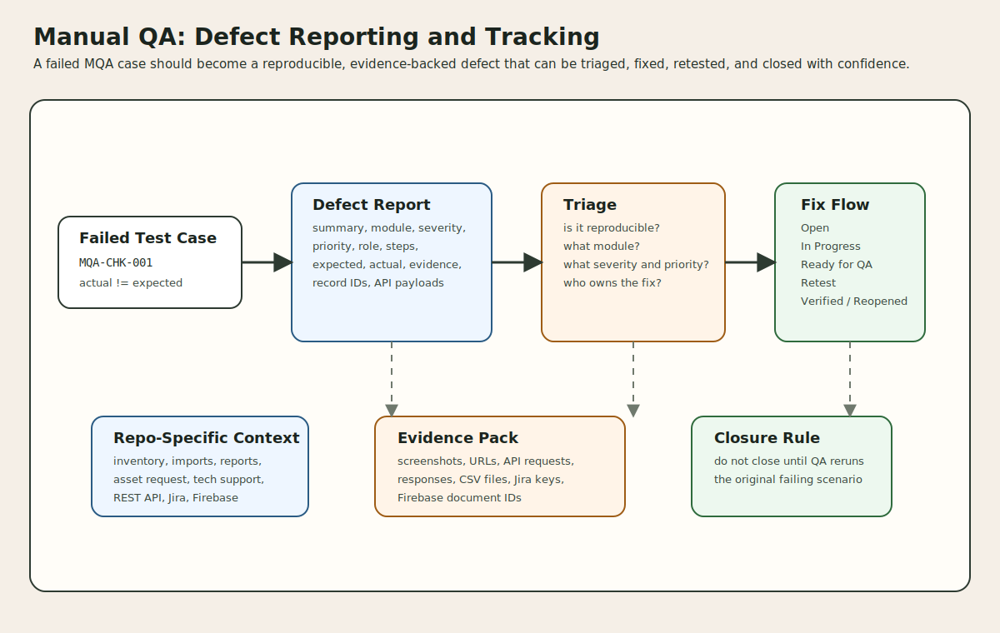

# Manual QA Testing: Defect Reporting and Tracking

This document describes how manual QA defects should be reported, classified, tracked, triaged, retested, and closed for this project. It is designed to work with the prepared manual test pack in `manual-qa-test-case-preparation.md` and the product areas visible in this codebase.

## 1. Purpose

The goal of defect reporting is not just to log bugs.

It is to create defect records that are:

1. reproducible
2. actionable by developers
3. traceable back to a manual test case or business workflow
4. easy to retest and close correctly

This document prepares a defect process for:

- core inventory defects
- self-service and acceptance defects
- import and reporting defects
- REST API defects
- custom asset-request defects
- custom tech-support, Firebase, and Jira integration defects

## 2. Relationship to the manual QA pack

This document assumes the team is preparing and executing manual cases like the `MQA-*` cases in [manual-qa-test-case-preparation.md](<C:/xampp/htdocs/snipe-it/docs/manual-qa-test-case-preparation.md>).

The two documents work together like this:

| QA artifact | Role |
| --- | --- |
| test case preparation | defines what to test |
| defect reporting and tracking | defines what to do when a case fails |

Every reported defect should ideally reference:

| Reference type | Example |
| --- | --- |
| manual test case ID | `MQA-CHK-001` |
| module | `Checkout`, `Importer`, `Tech Support`, `REST API` |
| build or deployment label | release/build under test |
| role used | `QA-ADMIN-01`, `QA-USER-01`, `QA-TECH-01` |

## 3. When to file a defect

A manual QA finding should be filed as a defect when one or more of these are true:

| Condition | File defect? |
| --- | --- |
| actual result differs from expected result | Yes |
| permission behavior is wrong | Yes |
| data is saved incorrectly or not saved | Yes |
| success path works but evidence/output is wrong | Yes |
| UI is misleading enough to block or confuse workflow completion | Usually yes |
| external integration succeeds only partially | Yes |
| issue is caused only by missing planned test data | No, unless environment prep itself failed |
| expected behavior is unclear or undocumented | raise as clarification first, then defect if confirmed |

## 4. Defect record structure

Each defect should use a consistent structure.

### 4.1 Required defect fields

| Field | What it should contain |
| --- | --- |
| Defect ID | tracker-generated ID such as `BUG-1042` |
| Summary | short statement of the failure |
| Module | product area |
| Severity | business and user impact |
| Priority | order in which the team should address it |
| Environment | QA, staging, UAT, local, or integration sandbox |
| Build/Version | exact build or deployment under test |
| Reporter | tester who found the issue |
| Role Used | account role used during reproduction |
| Test Case Reference | `MQA-*` case ID if applicable |
| Preconditions | setup state required before reproduction |
| Steps to Reproduce | clear numbered steps |
| Expected Result | what should happen |
| Actual Result | what actually happened |
| Evidence | screenshot, file, API response, Jira key, Firebase document name |
| Status | current lifecycle state |

### 4.2 Strongly recommended fields

| Field | Why it helps |
| --- | --- |
| URL or route | quickly localizes the failing screen or endpoint |
| sample record IDs | helps developers reproduce against the same data |
| browser/device | useful for UI-specific issues |
| API request/response capture | critical for REST API defects |
| integration name | needed for Jira, Firebase, Mongo, LDAP, SAML, or Google-login defects |
| workaround | helps business users while fix is pending |
| retest notes | tells QA exactly what was rechecked |

## 5. Defect title writing rules

A good defect title should read like a failure statement, not a vague topic.

### 5.1 Good title pattern

`[Module] [Action] [Object] [Failure]`

Examples:

- `[Checkout] Hardware checkout to user saves but asset remains unassigned`
- `[Importer] Duplicate-header CSV returns generic error instead of validation message`
- `[Tech Support] Approve ticket creates Jira issue but does not persist Jira key to Firebase`
- `[REST API] GET /api/v1/hardware/bytag/{tag} returns 200 error payload for missing asset`

### 5.2 Weak titles to avoid

- `Checkout issue`
- `Import bug`
- `Problem in report`
- `Jira broken`

## 6. Module/component taxonomy for this repo

Defect tracking is cleaner when all issues are tagged to a stable component list.

Recommended component/module values for this repo:

| Component | Typical scope |
| --- | --- |
| Auth and Setup | login, password reset, two-factor, setup, federation entry |
| Dashboard and Navigation | home routing, menu state, modals |
| Inventory Hardware | hardware CRUD, labels, barcode, assignment display |
| Inventory Accessories | accessory CRUD, checkout, checkin |
| Inventory Components | quantity-based assignment and return |
| Inventory Consumables | stock issue flows |
| Inventory Licenses and Seats | license and seat flows |
| Self-Service Account | assigned inventory, profile, password, email, print |
| Requests and Acceptance | requestable assets, request/cancel, accept/decline |
| Imports | importer UI, CSV upload, mapping, processing |
| Files and Labels | file uploads, previews, deletions, label PDFs |
| Reports | audit, depreciation, activity, custom reports |
| Admin Settings and Backups | security, notifications, backup operations |
| Asset Request Extension | custom request/approval/specification/chatbot flow |
| Tech Support Extension | request ticket, approve, resolve, diagnostics |
| REST API | `/api/v1` contract and behavior |
| External Integrations | Jira, Firebase, Mongo, LDAP, SAML, Google login |

### 6.1 Customization scope on selected software

For this document, the selected software is the Snipe-IT codebase in this repo, including the project-specific extensions layered onto the stock platform.

| Selected software area | Platform fit | Customization scope in this repo | Defect-reporting note |
| --- | --- | --- | --- |
| Authentication and setup | stock platform with local configuration | login, password reset, two-factor, setup, and optional federation entry points such as LDAP, SAML, and Google login | record the auth path used and whether the identity provider was `Ready`, `Mocked`, or out of scope |
| Inventory and circulation | primarily stock platform | hardware and peripheral CRUD, checkout, checkin, audit, restore, and acceptance behavior | treat assignment-state, permission, and data-integrity failures as core product defects |
| Self-service account flows | stock platform plus local workflow expectations | assigned inventory views, requestable assets, request cancellation, profile, and account-side acceptance flows | always capture the role used and the related asset/request state |
| Imports, files, labels, and reports | stock platform with environment-specific usage | CSV import, file upload/download, label output, custom report execution, and backup-adjacent admin flows | attach sample files, filters, exported artifacts, and record IDs wherever possible |
| Asset Request Extension | custom extension | MongoDB-backed asset request submission, approver assignment, technical-support assignment, approval, asset specification, deployment tracking, and chatbot helper flow | include MongoDB readiness, request ID, approver/support role, and any step where the flow stopped |
| Tech Support Extension | custom extension | Firebase-backed ticket submission and status tracking, approval workflow, Jira diagnostics, Jira issue creation, and local resolution flow | include Firebase document name, Jira issue key if created, and whether failure happened before or after Jira creation |
| REST API | stock surface with repo-specific contract checks | `/api/v1` smoke coverage for token management, requestable assets, checkout flows, and response-shape validation | capture method, endpoint, request payload, status code, and response body |
| External integrations | configuration and extension boundary | Jira, Firebase, MongoDB, LDAP, SAML, and Google login integrations that support the custom or configured workflows | separate environment/setup failures from true product defects, but log partial-success handoff failures as defects |

### 6.2 Customization scope-complexity tier

This tiering helps the team estimate how much QA depth, defect evidence, and retest effort each selected software area usually needs.

| Selected software area | Customization scope summary | Complexity tier | Why this tier fits |
| --- | --- | --- | --- |
| Authentication and setup | mostly stock authentication with local configuration and optional federation | `Medium` | the base flows are standard, but configuration differences across LDAP, SAML, Google login, and 2FA increase reproduction complexity |
| Inventory and circulation | largely stock CRUD, checkout, checkin, audit, restore, and acceptance workflows | `Medium` | behavior is well-established but stateful, permission-sensitive, and broad enough to create many regression combinations |
| Self-service account flows | stock account surfaces with local workflow expectations for requests and acceptance | `Medium` | user-role context and asset/request state matter, but the flows are still mostly within one product boundary |
| Imports, files, labels, and reports | stock-heavy file, artifact, and reporting workflows with environment-specific behavior | `High` | file inputs, export artifacts, and configuration-sensitive output make failures harder to isolate and retest consistently |
| Asset Request Extension | custom MongoDB-backed request, approval, assignment, specification, deployment, and chatbot flow | `High` | this is a multi-role custom workflow with custom persistence and several handoff points outside the stock platform |
| Tech Support Extension | custom Firebase-backed ticketing with Jira-linked approval and local resolution flow | `Very High` | it combines custom workflow logic, external dependencies, approval state, and split-failure risk between Firebase and Jira |
| REST API | stock API surface plus repo-specific contract expectations and smoke scenarios | `High` | contract defects can be subtle, evidence-heavy, and sensitive to both payload shape and HTTP/status behavior |
| External integrations | Jira, Firebase, MongoDB, LDAP, SAML, and Google login integration boundary | `Very High` | failures can come from config, permissions, network dependencies, or partial cross-system success, which makes triage and ownership harder |

## 7. Severity model

Severity should reflect impact, not team emotion.

| Severity | Meaning in this project | Example |
| --- | --- | --- |
| `Blocker` | release cannot proceed; core system or critical workflow is unusable | users cannot log in, imports crash app, checkout cannot complete for any asset |
| `Critical` | major workflow broken with no acceptable workaround | approved tech-support ticket cannot create Jira issue and cannot proceed |
| `Major` | important feature broken, incorrect data, or permission/security issue | asset checkin succeeds visually but leaves wrong assignment state |
| `Minor` | workflow still works but behavior is degraded or inconsistent | report filter labels are wrong but output is still correct |
| `Trivial` | cosmetic or very low-risk issue | spacing issue, non-blocking typo |

## 8. Priority model

Priority should reflect fix ordering.

Use the same spirit as the manual QA pack’s `P0` to `P2`, with an optional `P3` for housekeeping.

| Priority | Meaning |
| --- | --- |
| `P0` | must fix before release or signoff |
| `P1` | should fix in current cycle if possible |
| `P2` | can be scheduled after higher-risk issues |
| `P3` | backlog or low-value cleanup |

Severity and priority are related, but not identical.

Example:

- a `Major` issue in a release-critical workflow may still be `P0`
- a `Critical` issue in an out-of-scope integration sandbox may be temporarily downgraded in priority if the integration is excluded from the current release

## 9. Defect workflow states

The defect workflow should be simple enough to use consistently.

Recommended states:

| Status | Meaning |
| --- | --- |
| `New` | reported but not yet reviewed |
| `Triaged` | severity, priority, and ownership reviewed |
| `Open` | accepted as a real defect and queued |
| `In Progress` | actively being fixed |
| `Ready for QA` | developer believes fix is ready for retest |
| `Retest In Progress` | QA is revalidating |
| `Verified` | fix confirmed by QA |
| `Reopened` | issue persists or regression remains |
| `Deferred` | accepted but intentionally moved to later scope |
| `Duplicate` | already tracked elsewhere |
| `Rejected` | not a bug, not reproducible, or outside intended behavior |
| `Closed` | final done state after verification or final disposition |

## 10. Suggested defect lifecycle

| Step | Owner | Outcome |
| --- | --- | --- |
| 1. discover failure | QA | failing behavior is observed |
| 2. confirm basics | QA | environment, role, and data are checked |
| 3. create defect | QA | reproducible issue is logged with evidence |
| 4. triage | QA lead + product/dev lead | severity, priority, module, and scope are set |
| 5. assign | engineering lead | owner is chosen |
| 6. fix | developer | code/config/data fix is produced |
| 7. move to `Ready for QA` | developer | QA notified for retest |
| 8. retest | QA | issue is verified or reopened |
| 9. close | QA or agreed owner | verified or final disposition recorded |

## 11. Evidence requirements by defect type

Different defect classes need different evidence.

### 11.1 UI workflow defects

| Evidence | Example |
| --- | --- |
| screenshot or screen recording | checkout form error, missing success banner |
| page URL | `/hardware/123/checkout` |
| role used | `QA-ADMIN-01` |
| affected record ID | asset `123`, user `45` |

### 11.2 REST API defects

| Evidence | Example |
| --- | --- |
| endpoint and method | `POST /api/v1/hardware/123/checkout` |
| request body | submitted JSON or form fields |
| response body | exact payload returned |
| response code | `200`, `422`, `500`, etc. |
| auth context | token or user role used |

### 11.3 Import defects

| Evidence | Example |
| --- | --- |
| uploaded file | exact CSV used |
| mapping configuration | selected import type and field map |
| preview screenshot | header row / first-row preview |
| result message | success or failure output |

### 11.4 External integration defects

| Evidence | Example |
| --- | --- |
| integration name | Jira, Firebase, Mongo, LDAP |
| local record ID | ticket document ID, request ID |
| external reference | Jira issue key, Firebase document name |
| config readiness note | `Ready`, `Mocked`, or `Sandbox` |
| split-failure detail | for example, Jira created issue but Firebase writeback failed |

## 12. Reproducibility rules

Before submitting a defect, QA should make a reasonable attempt to confirm reproducibility.

| Check | Why it matters |
| --- | --- |
| repeat once with same account and data | rules out accidental step mistakes |
| confirm environment and build | prevents stale-environment confusion |
| confirm preconditions | many workflows depend on record state |
| note if issue is intermittent | helps triage flaky or timing-sensitive bugs |

Use one of these reproducibility labels:

| Value | Meaning |
| --- | --- |
| `Always` | happens every time with same setup |
| `Intermittent` | sometimes happens |
| `Cannot Reproduce Again` | observed once, not yet repeatable |

## 13. Required linkage to manual QA cases

Where possible, every manual defect should link back to a prepared case.

Recommended linkage fields:

| Link type | Example |
| --- | --- |
| originating test case | `MQA-CHK-001` |
| test cycle | `Regression Cycle 2026-06-03` |
| release scope | `vNext staging validation` |

This makes it easier to answer:

- which cases failed in a cycle
- which modules are unstable
- which defects block signoff

## 14. Defect templates for this repo

### 14.1 Standard UI defect template

| Field | Example |
| --- | --- |
| Summary | `[Checkout] Asset checkout to user succeeds visually but user inventory does not update` |
| Module | `Inventory Hardware` |
| Severity | `Major` |
| Priority | `P0` |
| Test Case Reference | `MQA-CHK-001` |
| Preconditions | deployable asset available; admin signed in; employee target exists |
| Steps | 1. Open checkout form. 2. Assign to user. 3. Submit. 4. Open employee inventory view. |
| Expected Result | asset appears as assigned to target user |
| Actual Result | success message is shown but asset remains unassigned in user inventory |
| Evidence | checkout screen screenshot, asset ID, target user ID |

### 14.2 REST API defect template

| Field | Example |
| --- | --- |
| Summary | `[REST API] Missing hardware by tag returns 200 with error body instead of 404` |
| Module | `REST API` |
| Severity | `Minor` or `Major` depending on contract expectation |
| Priority | `P2` |
| Test Case Reference | `MQA-API-003` |
| Request | `GET /api/v1/hardware/bytag/UNKNOWN-TAG` |
| Expected Result | not-found response per agreed API contract |
| Actual Result | HTTP `200` with `status=error` body |
| Evidence | request capture and response payload |

### 14.3 Integration defect template

| Field | Example |
| --- | --- |
| Summary | `[Tech Support] Ticket approval creates Jira issue but Firebase record does not store issue key` |
| Module | `Tech Support Extension` |
| Integration | `Jira + Firebase` |
| Severity | `Critical` |
| Priority | `P0` |
| Test Case Reference | `MQA-TS-003` |
| Preconditions | pending ticket exists; Jira sandbox ready; Firebase ready |
| Expected Result | Jira issue is created and persisted back to local ticket data |
| Actual Result | Jira issue exists, but ticket status page shows no Jira reference |
| Evidence | Jira issue key, Firebase document ID, UI screenshot |

## 15. Triage guidance for this codebase

During triage, defects should be grouped by impact area.

| Triage bucket | Examples |
| --- | --- |
| release-blocking core workflow | login, hardware checkout, checkin, import processing |
| permissions/security | unauthorized access, wrong role visibility, token/2FA problems |
| data integrity | wrong assignment state, missing action log, incorrect restore behavior |
| integration failure | Jira, Firebase, Mongo, LDAP, SAML |
| UI/UX | broken forms, missing banners, layout or workflow confusion |
| documentation or expectation gap | behavior unclear, needs product decision |

Recommended triage questions:

1. Can the issue be reproduced on the same build?
2. Is it caused by missing test data or by the product itself?
3. Does it affect release-critical flows from the `P0` test pack?
4. Is there a workaround?
5. Does it impact only one role or many roles?
6. Does it create bad data that needs cleanup?

## 16. Retest and closure rules

QA should not close a defect only because a developer says it is fixed.

A defect should be closed only after:

| Closure check | Meaning |
| --- | --- |
| original steps were rerun | same scenario validated |
| expected result now happens | core behavior corrected |
| no obvious side regression appears | surrounding workflow still works |
| evidence captured | screenshot, response body, or artifact as needed |
| retest note written | short summary of what was revalidated |

When to reopen:

| Reopen condition | Example |
| --- | --- |
| original failure still occurs | checkout still leaves asset unassigned |
| fix works partly but not fully | Jira issue creates, but status page still broken |
| same root issue appears in adjacent path | fix works in UI but API path still fails |

## 17. Tracking metrics worth capturing

If the team wants lightweight QA reporting, these are the most useful defect metrics.

| Metric | Why it helps |
| --- | --- |
| open defects by module | shows unstable product areas |
| open `P0` and `P1` defects | supports release readiness decisions |
| reopened defects | signals weak fixes or unclear requirements |
| integration defects by system | highlights Jira/Firebase/Mongo dependency risk |
| defects by test cycle | gives release-over-release comparison |

## 18. Tooling note for Jira tracking

Inference from the repo:

- this project already has Jira integration knowledge and credentials concepts in the codebase through the tech-support flow and `JiraIssueService`

That does **not** mean manual QA defects are already automatically created in Jira.

It does mean Jira is a practical candidate tracker for this repo because:

| Reason | Value |
| --- | --- |
| team already understands Jira concepts | lower process friction |
| issue keys are already familiar in the product context | easier cross-team communication |
| custom tech-support and QA defect workflows can share a common tracking vocabulary | clearer operational alignment |

If Jira is used for QA defects, recommended defect fields are:

| Jira field | Suggested use |
| --- | --- |
| Issue Type | `Bug` |
| Summary | use the defect title rules above |
| Description | use the defect template sections |
| Priority | map from `P0` to `P3` |
| Labels | `manual-qa`, module name, release label |
| Components | use the module taxonomy from this document |
| Attachments | screenshots, CSVs, request/response captures |
| Linked Issues | link related tech-support or integration tickets if relevant |

## 19. Practical rules for this project

| Rule | Why it matters |
| --- | --- |
| always record the role used | many workflows are permission-sensitive |
| always record the record IDs used | inventory bugs are state-dependent |
| link every defect to module taxonomy | helps triage and reporting |
| treat partial integration success as a real defect | especially for Jira/Firebase handoff issues |
| include API evidence for API-related defects | body shape and status code both matter |
| separate environment issues from product defects | avoids polluting bug count with setup mistakes |

## 20. Source of truth

- `docs/manual-qa-test-case-preparation.md`
- `docs/experience-apis.md`
- `docs/process-apis.md`
- `docs/external-system-integrations-jira.md`
- `docs/rest-api-endpoint-design.md`
- `docs/rest-api-request-response-format.md`
- `docs/rest-api-http-methods-and-status-codes.md`
- `routes/web.php`
- `routes/api.php`
- `app/Http/Controllers/Account/TechSupportController.php`
- `app/Services/JiraIssueService.php`
- `tests/Feature/Requests/Ui/TechSupportRequestTicketTest.php`
- `tests/Feature/Checkouts/*`
- `tests/Feature/Importing/*`
- `tests/Feature/Reporting/*`
- `tests/Feature/Requests/Ui/*`
