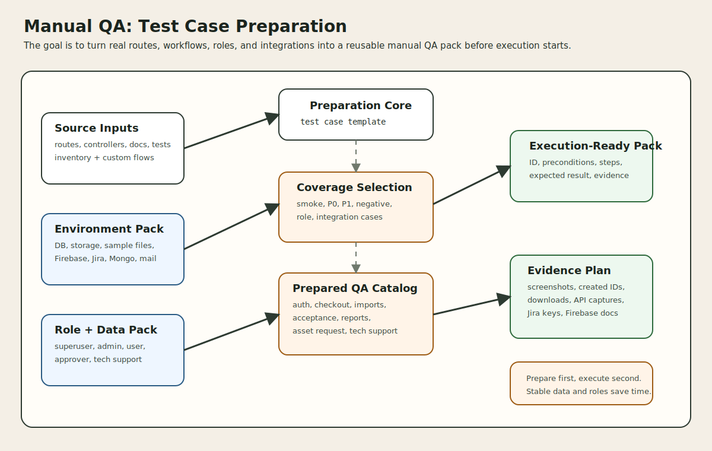

# Manual QA Testing: Test Case Preparation

This document prepares a manual QA test pack for this project. It is based on the actual product areas visible in the codebase: inventory management, self-service account flows, checkout and acceptance workflows, imports, reporting, uploads, admin settings, the custom asset-request extension, and the custom tech-support flow backed by Firebase and Jira.

## 1. Purpose

This document is not an execution report.

It is a preparation guide for manual QA that answers:

1. what areas should be covered
2. what environments and data need to exist first
3. which user roles are needed
4. how each manual test case should be structured
5. which concrete test cases should be prepared for this repo

## 2. Scope from the codebase

The prepared manual QA scope should cover these major product areas.

| Scope area | Why it belongs in the manual QA pack |
| --- | --- |
| setup and authentication | entry path, login, two-factor, auth redirects |
| inventory CRUD workspace | core admin product behavior |
| checkout, checkin, audit, restore | highest-value operational workflows |
| self-service account and requests | user-facing ownership experience |
| acceptance flows | legal/ownership confirmation behavior |
| imports and importer UI | high-risk admin workflow with file handling |
| files, labels, and downloads | mixed UI and storage behavior |
| reporting | operational visibility and filtering |
| admin settings and backups | sensitive system-level operations |
| asset request extension | custom Mongo-backed workflow |
| tech support extension | custom Firebase and Jira-backed workflow |
| REST API smoke coverage | machine-facing regression surface |

## 3. Source material for test preparation

The manual QA pack should be prepared from both implementation and existing automated test signals.

| Source type | Examples in this repo |
| --- | --- |
| route definitions | `routes/web.php`, `routes/web/*.php`, `routes/api.php` |
| controllers | account, API, inventory, settings, auth controllers |
| experience docs | `experience-apis.md`, `process-apis.md`, `system-apis.md` |
| integration docs | Jira integration and REST API integration docs |
| automated tests | checkout, acceptance, importing, reporting, request, and tech-support tests |

Representative automated test classes that help shape manual QA priorities:

| Test class | What it signals |
| --- | --- |
| `tests/Feature/Checkouts/Ui/AssetCheckoutTest.php` | asset checkout is core |
| `tests/Feature/Checkouts/Api/AssetCheckoutTest.php` | API checkout deserves smoke coverage |
| `tests/Feature/CheckoutAcceptances/Ui/AssetAcceptanceTest.php` | acceptance is a first-class workflow |
| `tests/Feature/Importing/Ui/ImportTest.php` | importer UI is important |
| `tests/Feature/Importing/Api/ImportAssetsTest.php` | import behavior is broad and high-risk |
| `tests/Feature/Reporting/CustomReportTest.php` | reporting needs validation |
| `tests/Feature/Requests/Ui/AssetRequestIndexTest.php` | request flows matter |
| `tests/Feature/Requests/Ui/TechSupportRequestTicketTest.php` | custom Firebase/Jira flow is important |

## 4. Preparation strategy

Manual QA should be prepared in layers.

| Layer | Goal |
| --- | --- |
| smoke | verify the product is usable end-to-end after deployment |
| critical regression | verify core business workflows still work |
| feature regression | verify module-specific edge behavior |
| integration regression | verify external dependencies and handoffs |
| role/permission checks | verify the right users can and cannot perform actions |

Suggested priority model:

| Priority | Meaning |
| --- | --- |
| `P0` | release-blocking business path |
| `P1` | important workflow or permission path |
| `P2` | useful regression or lower-risk scenario |

## 5. Environment preparation

Before writing or executing cases, the QA environment should be prepared deliberately.

### 5.1 Required environment checklist

| Preparation item | Why it matters |
| --- | --- |
| working application install | base requirement for all cases |
| database with realistic seed data | inventory and user workflows depend on it |
| writable storage | imports, uploads, labels, and backups need it |
| mail configuration or safe mail fake | notification-related screens may trigger outbound behavior |
| queue or synchronous fallback awareness | some notifications and side effects may depend on it |
| sample files on disk | upload and import cases need ready inputs |
| role-based test accounts | many workflows are permission-sensitive |
| optional external integration sandboxes | needed for Jira, Firebase, Mongo-backed flows, LDAP, SAML, Google login if in scope |

### 5.2 External integration readiness

Prepare these as `Ready`, `Not in Scope`, or `Mocked`.

| Integration | Manual QA prep status to decide |
| --- | --- |
| Jira | needed for tech-support approval-to-issue case |
| Firebase | needed for tech-support ticket persistence |
| Mongo-backed asset request services | needed for custom asset request flow |
| LDAP | needed only if identity sync/test cases are in scope |
| Google login | needed only if social login is in scope |
| SAML | needed only if federated login is in scope |

## 6. Test account preparation

A reusable role matrix makes the test pack faster to execute.

| Test role | Main use |
| --- | --- |
| superuser | settings, backups, full admin control |
| inventory admin | CRUD, checkout, checkin, reports |
| standard employee | self-service, requests, acceptance |
| manager | manager-view and approval-adjacent checks where enabled |
| approver | asset-request approval and tech-support approval |
| technical support | tech-support approval, diagnostics, resolution |
| API-enabled user | personal access token and API smoke checks |

Recommended account pack:

| Account ID | Role suggestion |
| --- | --- |
| `QA-SUPER-01` | superuser |
| `QA-ADMIN-01` | inventory admin |
| `QA-USER-01` | standard employee |
| `QA-MANAGER-01` | manager |
| `QA-APPROVER-01` | approver |
| `QA-TECH-01` | technical support |

## 7. Test data preparation

Manual QA becomes faster and more repeatable when data packs are prepared ahead of time.

### 7.1 Core data pack

| Data item | Minimum prepared state |
| --- | --- |
| hardware asset A | deployable and available for checkout |
| hardware asset B | already checked out |
| hardware asset C | requestable |
| hardware asset D | soft-deleted or archived for restore testing |
| accessory A | quantity greater than 1 |
| component A | quantity-based assignment candidate |
| consumable A | available stock |
| license A | at least one available seat |
| location A | active location |
| model A | associated category/manufacturer |
| category A | deployable inventory type |
| user target A | valid assignee |

### 7.2 File and import data pack

| Data item | Use |
| --- | --- |
| valid CSV import file | importer happy path |
| invalid CSV or duplicate-header file | importer negative path |
| sample PNG/JPG | file upload positive case |
| sample PDF | preview/download and file upload case |

### 7.3 Custom-flow data pack

| Data item | Use |
| --- | --- |
| pending asset request | approval flow validation |
| pending tech-support ticket | approval and resolution validation |
| Jira sandbox project and API credentials | issue-creation validation |
| Firebase helpdesk collection access | ticket persistence validation |

## 8. Test case template

Every manual QA test case should be prepared in a consistent shape.

| Field | What to capture |
| --- | --- |
| Test Case ID | stable identifier such as `MQA-CHK-001` |
| Module | feature area |
| Priority | `P0`, `P1`, or `P2` |
| Type | smoke, regression, permission, negative, integration |
| Title | short human-readable scenario |
| Preconditions | account, config, and data requirements |
| Test Data | exact records or files needed |
| Steps | concise user actions |
| Expected Result | observable success criteria |
| Evidence | screenshot, URL, exported file, created record, log, or Jira key |
| Notes | cleanup or environment caveats |

Recommended concise test-case row format:

| ID | Module | Priority | Title | Preconditions | Steps Summary | Expected Result |
| --- | --- | --- | --- | --- | --- | --- |
| `MQA-CHK-001` | Checkout | `P0` | Checkout hardware to user | deployable asset + admin user + employee target | open checkout form, assign asset, submit | success message, assignment updated, record visible in user inventory |

## 9. Entry criteria for a manual QA cycle

Before execution begins, the prepared pack should confirm:

| Entry criterion | Check |
| --- | --- |
| build is deployable | app loads without fatal setup issues |
| seed data exists | required users, assets, accessories, components, and files are available |
| integration scope is decided | Jira/Firebase/Mongo/LDAP/SAML marked ready or out of scope |
| test accounts work | all role accounts can sign in |
| expected notifications behavior is known | real outbound or mocked |
| environment reset plan exists | cleanup path for imports, uploads, and created requests |

## 10. Prepared manual QA catalog

Below is a starter prepared test pack tailored to this repo.

### 10.1 Authentication and setup

| ID | Priority | Title | Preconditions | Steps Summary | Expected Result |
| --- | --- | --- | --- | --- | --- |
| `MQA-AUTH-001` | `P0` | Local login succeeds | active user account exists | open `/login`, submit valid credentials | user lands on the correct home experience |
| `MQA-AUTH-002` | `P1` | Invalid login is rejected | active user account exists | submit invalid password | login fails with visible error and no session created |
| `MQA-AUTH-003` | `P1` | Password reset screen is reachable | mail flow in scope or mocked | open reset page and submit address | reset request is accepted or safely blocked by config |
| `MQA-AUTH-004` | `P2` | Two-factor challenge path works | account with 2FA enabled | sign in through 2FA-protected account | challenge page appears and valid code completes login |

### 10.2 Inventory admin workspace

| ID | Priority | Title | Preconditions | Steps Summary | Expected Result |
| --- | --- | --- | --- | --- | --- |
| `MQA-INV-001` | `P0` | Hardware index loads and filters | admin account + seeded assets | open hardware list, search and sort | list renders, search/sort respond correctly |
| `MQA-INV-002` | `P1` | Create hardware asset | admin account + model/category data | open create form, fill required fields, save | asset is created and visible in list/detail view |
| `MQA-INV-003` | `P1` | Update hardware asset | existing asset | edit asset fields and save | saved changes appear on refresh |
| `MQA-INV-004` | `P1` | Restore archived asset | archived asset exists | trigger restore action | asset becomes active again and success feedback is shown |

### 10.3 Checkout, checkin, and audit

| ID | Priority | Title | Preconditions | Steps Summary | Expected Result |
| --- | --- | --- | --- | --- | --- |
| `MQA-CHK-001` | `P0` | Checkout hardware to user | deployable asset + employee target | open checkout form and submit assignment | asset becomes assigned and user inventory reflects it |
| `MQA-CHK-002` | `P0` | Checkin checked-out hardware | checked-out asset exists | open checkin form and submit | asset returns to available state |
| `MQA-CHK-003` | `P1` | Checkout accessory | accessory with stock exists | perform accessory checkout | checked-out quantity and history update correctly |
| `MQA-CHK-004` | `P1` | Checkin accessory | accessory checkout row exists | perform accessory checkin | checkout row is removed or updated correctly |
| `MQA-CHK-005` | `P1` | Component quantity assignment and return | component with available qty exists | checkout component qty then partially check it in | remaining quantity is tracked correctly |
| `MQA-AUD-001` | `P1` | Audit asset | auditable asset exists | record audit from UI or API-backed flow | audit metadata and history update successfully |

### 10.4 Self-service and acceptance

| ID | Priority | Title | Preconditions | Steps Summary | Expected Result |
| --- | --- | --- | --- | --- | --- |
| `MQA-SELF-001` | `P0` | Employee can view assigned inventory | standard user with assigned items | open `/account/view-assets` | assigned assets and related items display correctly |
| `MQA-SELF-002` | `P1` | Employee requests requestable asset | requestable asset exists | open requestable assets page and submit request | request is recorded and visible in requested view |
| `MQA-SELF-003` | `P1` | Employee cancels outstanding request | prior request exists | cancel request | request disappears or is marked canceled |
| `MQA-ACCPT-001` | `P1` | User accepts assigned asset | pending acceptance exists | open acceptance page and accept | acceptance status, signature/EULA evidence, and history update |
| `MQA-ACCPT-002` | `P2` | User declines assigned asset | pending acceptance exists | submit decline path | decline is recorded and visible in history |

### 10.5 Imports and files

| ID | Priority | Title | Preconditions | Steps Summary | Expected Result |
| --- | --- | --- | --- | --- | --- |
| `MQA-IMP-001` | `P0` | Importer accepts valid CSV and shows preview | admin account + valid CSV | open importer, upload file | preview, headers, and mapping UI appear |
| `MQA-IMP-002` | `P1` | Import processing succeeds with valid mapping | saved import exists | map columns and process import | records are created and redirect/success feedback appears |
| `MQA-IMP-003` | `P1` | Duplicate-header CSV is rejected | invalid CSV prepared | upload duplicate-header CSV | validation error is shown before processing |
| `MQA-FILE-001` | `P1` | Upload evidence file to supported object | object record exists + sample file | upload file to asset/user/etc. | file appears in attachment list |
| `MQA-FILE-002` | `P2` | Inline preview or download works | uploaded previewable file exists | open file endpoint or UI link | file downloads or previews successfully |

### 10.6 Reports and admin ops

| ID | Priority | Title | Preconditions | Steps Summary | Expected Result |
| --- | --- | --- | --- | --- | --- |
| `MQA-RPT-001` | `P1` | Audit report loads | admin or permitted user | open `/reports/audit` | report renders without fatal errors |
| `MQA-RPT-002` | `P1` | Custom report filtering works | seeded reportable data exists | apply custom filters and run report | filtered output matches expectations |
| `MQA-ADM-001` | `P1` | Settings page saves allowed changes | superuser account | edit safe setting and save | success feedback and persisted value |
| `MQA-ADM-002` | `P2` | Backup list/download path works | backups feature enabled | open backups page and download available backup | backup list renders and download succeeds |

### 10.7 Custom asset request extension

| ID | Priority | Title | Preconditions | Steps Summary | Expected Result |
| --- | --- | --- | --- | --- | --- |
| `MQA-AR-001` | `P1` | Employee submits custom asset request | Mongo-backed request service ready | open `/assetRequest`, submit request | request is stored and success feedback appears |
| `MQA-AR-002` | `P1` | Approver reviews and approves asset request | pending custom request exists | open approval page and approve | request status updates correctly |
| `MQA-AR-003` | `P2` | Technical support stores asset specification | approved request exists | open specification screen and save details | specification persists and is visible on reload |

### 10.8 Custom tech support and Jira integration

| ID | Priority | Title | Preconditions | Steps Summary | Expected Result |
| --- | --- | --- | --- | --- | --- |
| `MQA-TS-001` | `P0` | Employee submits tech-support ticket | Firebase-ready environment or approved mock | submit request-ticket form | ticket saves successfully and preview/status data is visible |
| `MQA-TS-002` | `P1` | Technical-support user opens Jira diagnostics | Jira config and permission gate prepared | open `/tech-support/jira-diagnostics` | diagnostics page loads and shows config/project/permission checks |
| `MQA-TS-003` | `P0` | Approving ticket creates Jira issue reference | pending Firebase ticket + Jira sandbox ready | approve ticket | success message includes issue key and ticket status shows Jira link |
| `MQA-TS-004` | `P1` | Resolver closes approved ticket | approved ticket exists | submit resolution | ticket moves to closed state successfully |

### 10.9 REST API smoke

| ID | Priority | Title | Preconditions | Steps Summary | Expected Result |
| --- | --- | --- | --- | --- | --- |
| `MQA-API-001` | `P1` | Personal API token create/list/revoke | API-enabled user account | create token, list tokens, revoke token | token lifecycle behaves correctly including `204` revoke |
| `MQA-API-002` | `P1` | Requestable hardware API returns datatable payload | authenticated API client + requestable asset | call `/api/v1/account/requestable/hardware` | response has expected `total`/`rows` shape |
| `MQA-API-003` | `P2` | Hardware checkout API returns body-level success/error contract | API client + deployable asset | call checkout happy path and one invalid path | response shape and status/body handling match docs |

## 11. Negative-case preparation

Every prepared pack should include at least one negative test per critical module.

| Module | Minimum negative case to prepare |
| --- | --- |
| auth | invalid credentials |
| checkout | checkout unavailable or invalid target |
| request flow | non-requestable asset |
| importer | invalid CSV or duplicate headers |
| uploads | missing file or unsupported file type |
| reports | permission denial or empty dataset |
| tech support | Firebase unavailable or Jira approval failure |
| REST API | invalid ID, forbidden action, or malformed filter |

## 12. Evidence and defect-capture guidance

Manual QA execution will be easier if each prepared case already states what evidence to collect.

| Evidence type | Example |
| --- | --- |
| screenshot | success/error banner, rendered page, status table |
| URL and role used | exact route and account used |
| created record ID | asset ID, import ID, request ID, ticket document ID |
| downloaded artifact | backup file, import output, label PDF |
| external reference | Jira issue key, Firebase document name |
| API capture | request and response body for smoke API cases |

## 13. Exit checklist for prepared test pack

Before handing the pack to QA execution, confirm:

| Check | Ready when... |
| --- | --- |
| scope | critical modules are represented |
| data | every `P0` and `P1` case has named test data |
| roles | every case names the right actor account |
| integrations | marked ready, mocked, or excluded |
| evidence | expected proof is defined |
| cleanup | destructive or stateful cases include reset notes |

## 14. Source of truth

- `routes/web.php`
- `routes/web/*.php`
- `routes/api.php`
- `app/Http/Controllers/*`
- `app/Http/Controllers/Account/*`
- `app/Livewire/Importer.php`
- `docs/experience-apis.md`
- `docs/process-apis.md`
- `docs/external-system-integrations-jira.md`
- `docs/rest-api-endpoint-design.md`
- `docs/rest-api-request-response-format.md`
- `docs/rest-api-http-methods-and-status-codes.md`
- `tests/Feature/Checkouts/*`
- `tests/Feature/CheckoutAcceptances/*`
- `tests/Feature/Importing/*`
- `tests/Feature/Reporting/*`
- `tests/Feature/Requests/Ui/*`
