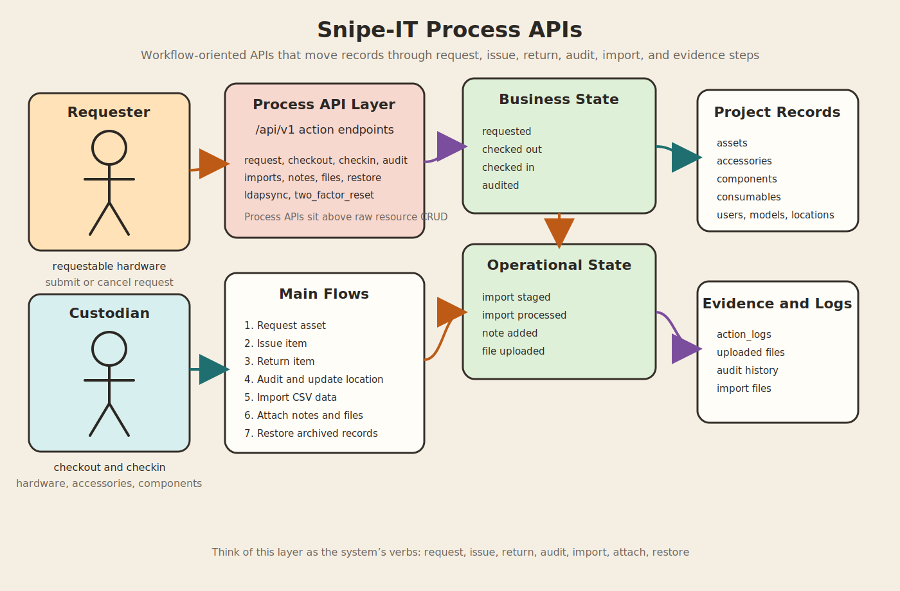

# Process APIs

This document describes the workflow-oriented APIs in this Snipe-IT project. If `system-apis.md` explains what the platform exposes, this page explains how those endpoints are combined to move work through real business processes.

## 1. What "Process APIs" mean here

In this project, Process APIs are the endpoints that drive lifecycle actions rather than just CRUD storage. They are the APIs used to:

- request assets
- issue or assign inventory
- check items back in
- audit assets
- import records in bulk
- attach evidence such as files and notes
- restore archived records
- run admin-side operational actions such as LDAP sync

Most of these workflows sit on top of the REST API under `/api/v1`.

## 2. Relationship to the System API layer

The System API layer exposes the raw route surface.

The Process API layer answers a different question:

1. What business event is happening?
2. Which endpoints participate in that event?
3. What state changes should a client expect?
4. What follow-up endpoints are usually called next?

That makes this layer especially useful for:

- internal architecture documentation
- integration planning
- onboarding new developers
- designing automation scripts

## 3. Core process families

### 3.1 Request process

Purpose:
Let a user discover requestable hardware, submit a request, inspect their open requests, and cancel if needed.

Main endpoints:

- `GET /api/v1/account/requestable/hardware`
- `POST /api/v1/account/request/{asset}`
- `GET /api/v1/account/requests`
- `POST /api/v1/account/request/{asset}/cancel`

How the process works:

1. The client queries requestable hardware.
2. The user submits a request for a specific asset.
3. The system creates a checkout request through `CreateCheckoutRequestAction`.
4. The user can later inspect outstanding requests.
5. If needed, the request can be canceled through `CancelCheckoutRequestAction`.

Process notes:

- This is a lightweight request workflow, not a full BPM engine.
- Business permission failures are usually returned in the JSON envelope.
- The request process is self-service and bound to the authenticated user.

### 3.2 Asset circulation process

Purpose:
Move hardware assets through assignment, return, and tracking steps.

Main endpoints:

- `POST /api/v1/hardware/{id}/checkout`
- `POST /api/v1/hardware/{id}/checkin`
- `POST /api/v1/hardware/bytag/{tag}/checkout`
- `POST /api/v1/hardware/bytag/{tag}/checkin`
- `POST /api/v1/hardware/checkinbytag`
- `GET /api/v1/hardware/bytag/{tag}`
- `GET /api/v1/hardware/byserial/{serial}`
- `GET /api/v1/hardware/{asset}/assigned/assets`
- `GET /api/v1/hardware/{asset}/assigned/accessories`
- `GET /api/v1/hardware/{asset}/assigned/components`

Checkout targets supported by the API:

- user
- asset
- location

How the process works:

1. A client resolves the asset by ID, tag, or serial.
2. The client submits a checkout request with a target type and target ID.
3. The controller validates availability and target existence.
4. The asset is checked out through the domain method `checkOut(...)`.
5. On return, the client submits a checkin request.
6. The API clears assignment state, expected checkin state, pending acceptances, and attached license-seat assignments.
7. A checkin event is emitted for downstream logging and notification behavior.

Process notes:

- Checkout can optionally set `status_id`, `expected_checkin`, `note`, and checkout timestamp.
- Checkin can optionally update location, default location, status, note, and name.
- The "assigned" endpoints are follow-up APIs that help visualize downstream relationships after checkout.

### 3.3 Accessory circulation process

Purpose:
Issue accessories to people or other targets and later return them.

Main endpoints:

- `POST /api/v1/accessories/{accessory}/checkout`
- `POST /api/v1/accessories/{accessory}/checkin`
- `GET /api/v1/accessories/{accessory}/checkedout`

How the process works:

1. The client submits a checkout request with the target and optional quantity.
2. The system creates one or more `AccessoryCheckout` records.
3. A checkout event is emitted.
4. The checked-out rows can be inspected with the checked-out listing endpoint.
5. Checkin removes the checkout row and logs the return.

Process notes:

- Accessory checkin uses the checkout row ID rather than the accessory ID alone.
- The API returns a pivot/check-out record ID that can be used in the return flow.

### 3.4 Component assignment process

Purpose:
Attach component quantities to assets and later partially or fully return them.

Main endpoints:

- `POST /api/v1/components/{id}/checkout`
- `POST /api/v1/components/{id}/checkin`
- `GET /api/v1/components/{component}/assets`

How the process works:

1. The client selects a component and target asset.
2. The API validates `assigned_to` and `assigned_qty`.
3. The controller attaches the component to the asset through the `components_assets` join table.
4. On return, the client submits the join-row ID and a `checkin_qty`.
5. The join record is reduced or deleted depending on the remaining quantity.

Process notes:

- This is a quantity-based process, not a simple single-item assignment.
- Partial checkin is supported.
- The assets endpoint is a useful follow-up query to inspect where a component is in use.

### 3.5 Consumable issue process

Purpose:
Issue non-returnable or effectively consumed stock to users.

Main endpoints:

- `POST /api/v1/consumables/{consumable}/checkout`
- `GET /api/v1/consumables/{id}/users`

How the process works:

1. The client submits a user target and requested quantity.
2. The API validates inventory availability and category validity.
3. The system attaches one or more issue rows to the user.
4. A checkout event is emitted.
5. Consumers of the API can list who has received the consumable.

Process notes:

- This flow is intentionally one-way compared with hardware and accessories.
- There is no symmetric consumable checkin route in the API.

### 3.6 Audit and compliance process

Purpose:
Record asset audits and monitor assets that are due or overdue for operational action.

Main endpoints:

- `POST /api/v1/hardware/{asset}/audit`
- `POST /api/v1/hardware/audit` (legacy)
- `GET /api/v1/hardware/audit/{status}`
- `GET /api/v1/hardware/audits/{status}`
- `GET /api/v1/hardware/checkins/{status}`
- `GET /api/v1/reports/depreciation`

Supported status filters:

- `due`
- `overdue`
- `due-or-overdue`

How the process works:

1. A client finds assets needing action through due or overdue list endpoints.
2. An audit request is submitted for a specific asset.
3. The API updates `last_audit_date`, computes or accepts `next_audit_date`, and can optionally update physical location.
4. If the asset's model fieldset exposes audit fields, custom audit data is written too.
5. The system saves the audit without producing a normal asset-update log entry, then writes an audit log entry instead.

Process notes:

- This is one of the more domain-rich processes in the project.
- The depreciation report route reuses the asset listing controller with report-specific authorization and filtering.

### 3.7 Import process

Purpose:
Bulk-ingest CSV data into different master-data and inventory domains.

Main endpoints:

- `POST /api/v1/imports`
- `POST /api/v1/imports/process/{import}`
- `GET /api/v1/imports`
- `DELETE /api/v1/imports/{import}`

Supported import types:

- `asset`
- `assetModel`
- `accessory`
- `consumable`
- `component`
- `license`
- `user`
- `location`
- `supplier`
- `manufacturer`
- `category`

How the process works:

1. The client uploads one or more CSV files.
2. The API validates MIME type, encoding, and duplicate headers.
3. The system stores the file and captures header and first-row preview data.
4. The client triggers processing for a saved import.
5. The API optionally runs a backup before processing.
6. Import mapping and insertion run through the import request logic.
7. The API returns either import errors or a success response with a `redirect_url`.

Process notes:

- Upload and processing are intentionally split into two API steps.
- Import is one of the clearest examples of a long-running business process exposed as API calls.

### 3.8 Notes and evidence process

Purpose:
Attach narrative context and uploaded evidence to tracked records.

Main endpoints:

- `GET /api/v1/notes/{asset}/index`
- `POST /api/v1/notes/{asset}/store`
- `GET /api/v1/{object_type}/{id}/files`
- `GET /api/v1/{object_type}/{id}/files/{file_id}`
- `POST /api/v1/{object_type}/{id}/files`
- `DELETE /api/v1/{object_type}/{id}/files/{file_id}/delete`

Supported attachment object types:

- `accessories`
- `audits`
- `assets`
- `components`
- `consumables`
- `hardware`
- `licenses`
- `locations`
- `maintenances`
- `models`
- `suppliers`
- `users`

How the process works:

1. The client creates notes for an asset when narrative justification is needed.
2. The API stores notes as action-log records of type `note added`.
3. For file evidence, the client uploads one or more files to a supported object type.
4. The API stores the file and logs the upload against the object.
5. The client can later list, download, preview inline, or delete the attachment.

Process notes:

- Notes and file uploads are cross-cutting support processes for audits, imports, maintenance, and ownership workflows.
- File APIs check both object permissions and file existence.

### 3.9 Recovery and reactivation process

Purpose:
Restore soft-deleted or archived records back into active use.

Main endpoints:

- `POST /api/v1/hardware/{asset_id}/restore`
- `POST /api/v1/manufacturers/{id}/restore`
- `POST /api/v1/models/{id}/restore`
- `POST /api/v1/users/{user}/restore`

How the process works:

1. A client identifies an archived record.
2. The restore endpoint is called for the resource type.
3. The API restores the model and records the restore activity.
4. The restored entity becomes available to downstream operational workflows again.

Process notes:

- Restore endpoints are important because this project uses soft-delete style lifecycle handling for several domains.

### 3.10 Operational identity process

Purpose:
Run selected admin-side identity and support operations through the API.

Main endpoints:

- `POST /api/v1/users/ldapsync`
- `POST /api/v1/users/two_factor_reset`
- `GET /api/v1/users/me`

How the process works:

1. An admin or support client triggers an identity operation.
2. The API enforces user-level authorization.
3. Backend jobs or commands run, such as the LDAP sync artisan command.
4. The API returns a summary or failure message in the standard response envelope.

Process notes:

- This process family is more operational than inventory-facing.
- It still belongs in the Process API layer because it changes business identity state rather than just reading records.

## 4. End-to-end workflow examples

### 4.1 Self-service asset request

1. `GET /api/v1/account/requestable/hardware`
2. `POST /api/v1/account/request/{asset}`
3. `GET /api/v1/account/requests`
4. Optional: `POST /api/v1/account/request/{asset}/cancel`

### 4.2 Issue and return a hardware asset

1. `GET /api/v1/hardware/bytag/{tag}` or `GET /api/v1/hardware/{id}`
2. `POST /api/v1/hardware/{id}/checkout`
3. Optional follow-up: `GET /api/v1/hardware/{asset}/assigned/assets`
4. `POST /api/v1/hardware/{id}/checkin`

### 4.3 Bulk import inventory data

1. `POST /api/v1/imports`
2. Inspect returned import metadata and preview information
3. `POST /api/v1/imports/process/{import}`
4. Optional cleanup: `DELETE /api/v1/imports/{import}`

### 4.4 Audit an asset with evidence

1. `GET /api/v1/hardware/audits/due-or-overdue`
2. `POST /api/v1/hardware/{asset}/audit`
3. `POST /api/v1/notes/{asset}/store`
4. `POST /api/v1/assets/{asset}/files`

## 5. Design observations from the code

- The project favors action endpoints such as `/checkout`, `/checkin`, `/audit`, and `/restore` when the business transition matters more than pure REST semantics.
- Several workflows emit domain events after state transitions, which suggests notifications and audit logging are part of the process contract.
- Some process APIs return success or business-error payloads with HTTP `200`, so clients should inspect both transport status and the JSON `status` field.
- File uploads, notes, and logs act as supporting process evidence rather than standalone domains.
- Import and audit are the richest processes because they combine validation, state transition, logging, and follow-up behavior.

## 6. Source of truth

The main source files behind these workflows are:

- `routes/api.php`
- `app/Http/Controllers/Api/CheckoutRequest.php`
- `app/Http/Controllers/Api/AssetsController.php`
- `app/Http/Controllers/Api/AccessoriesController.php`
- `app/Http/Controllers/Api/ComponentsController.php`
- `app/Http/Controllers/Api/ConsumablesController.php`
- `app/Http/Controllers/Api/ImportController.php`
- `app/Http/Controllers/Api/NotesController.php`
- `app/Http/Controllers/Api/UploadedFilesController.php`
