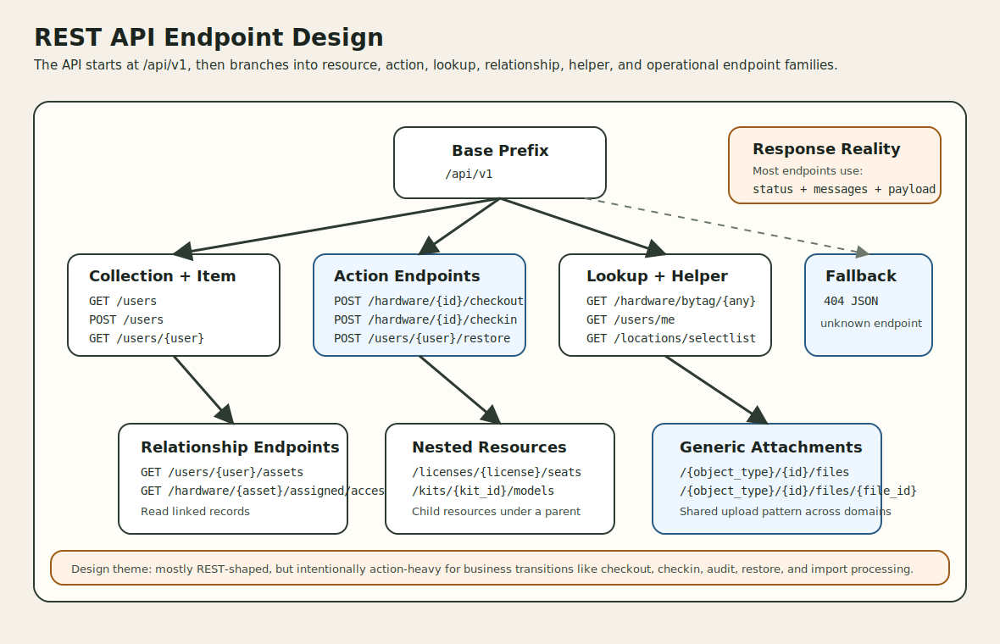

# REST API Integration: Endpoint Design

This document describes how the REST API endpoints in this project are designed. It focuses on the structure of the `/api/v1` route surface, the naming and parameter conventions, the mix of CRUD and action-style endpoints, and the response patterns an integrator should expect.



## 1. What "Endpoint Design" means here

For this project, endpoint design means more than just listing URLs.

It answers questions like:

1. How are API routes grouped and versioned?
2. When does the API use plain REST nouns versus action verbs?
3. How are relationships, lookups, and helper lists exposed?
4. How consistent are parameters and response envelopes across the route surface?

This is especially useful for:

- integration planning
- SDK or client generation
- API governance reviews
- onboarding developers who need to work with `/api/v1`

## 2. Base shape of the API

The API is organized under a single versioned prefix and then split into domain-focused route groups.

| Design element | Implementation in this repo | Meaning |
| --- | --- | --- |
| Base prefix | `/api/v1` | All documented REST routes live under a versioned namespace |
| Global middleware | `api`, `api-throttle:api` | The whole API gets standard API middleware plus throttling |
| Root endpoint | `GET /api/v1/` | Returns a JSON error payload explaining that the base URL is not a usable business endpoint |
| Fallback endpoint | route fallback inside `/api/v1` | Unknown paths return a JSON error payload with HTTP `404` |
| Version endpoint | `GET /api/v1/version` | Returns application version metadata outside the standard envelope |

Design observation:

- The route file treats versioning as part of the URL contract, not as a header negotiation concern.

## 3. Core endpoint families

The route design is hybrid. It uses REST resource controllers for the baseline shape, then adds explicit action endpoints where lifecycle transitions matter.

| Endpoint family | General pattern | Typical examples | Purpose |
| --- | --- | --- | --- |
| Collection resource | `GET /resource`, `POST /resource` | `/users`, `/hardware`, `/licenses` | List and create records |
| Item resource | `GET /resource/{id}`, `PUT/PATCH /resource/{id}`, `DELETE /resource/{id}` | `/users/{user}`, `/hardware/{asset}` | Read, update, or delete one record |
| Action endpoint | `POST /resource/{id}/verb` | `/hardware/{id}/checkout`, `/hardware/{asset}/audit`, `/users/{user}/restore` | Perform a business transition |
| Lookup endpoint | `GET /resource/by.../{value}` | `/hardware/bytag/{any}`, `/hardware/byserial/{any}` | Resolve records by operational identifiers |
| Relationship endpoint | `GET /resource/{id}/related` | `/users/{user}/assets`, `/hardware/{asset}/assigned/accessories` | Read linked objects |
| Helper endpoint | `GET /resource/selectlist` | `/locations/selectlist`, `/statuslabels/selectlist` | Return UI-friendly selector data |
| Nested resource | `/parent/{id}/child` | `/licenses/{license}/seats`, `/kits/{kit_id}/models` | Manage subresources scoped to a parent |
| Generic attachment endpoint | `/{object_type}/{id}/files` | `/hardware/123/files`, `/users/7/files` | Handle uploads across many object types |
| Self-service endpoint | `/account/...` | `/account/requests`, `/account/personal-access-tokens` | Expose authenticated user-specific actions |
| Operational endpoint | purpose-specific routes | `/imports/process/{import}`, `/users/ldapsync`, `/settings/backups` | Admin or support operations that are not simple CRUD |

## 4. Resource naming strategy

The API mostly follows plural, domain-noun naming, but there are a few intentional domain and legacy choices.

### 4.1 Primary resource nouns

| URI noun | Domain meaning |
| --- | --- |
| `accessories` | accessory inventory |
| `categories` | item classification |
| `companies` | company ownership scope |
| `components` | attachable component inventory |
| `consumables` | issued stock |
| `depreciations` | depreciation schedules |
| `fields` | custom fields |
| `fieldsets` | custom field groups |
| `groups` | user permission or grouping domain |
| `hardware` | asset inventory |
| `imports` | import sessions |
| `kits` | predefined kits |
| `licenses` | software licenses |
| `locations` | physical or organizational locations |
| `maintenances` | asset maintenance records |
| `manufacturers` | manufacturer reference data |
| `models` | asset models |
| `notes` | asset note endpoints |
| `reports` | report-producing endpoints |
| `settings` | administrative settings and ops |
| `statuslabels` | deployable/archive/pending state labels |
| `suppliers` | supplier reference data |
| `users` | user directory and ownership actor |

### 4.2 Naming patterns that stand out

| Pattern | Example | Meaning |
| --- | --- | --- |
| Plural noun collections | `/users`, `/suppliers`, `/locations` | Standard resource grouping |
| Domain-preferred noun | `/hardware` instead of `/assets` | The project uses "hardware" as the primary URI surface for assets |
| Verb suffix for state change | `/checkout`, `/checkin`, `/restore`, `/audit` | The route emphasizes the business transition |
| Special lookup segment | `/bytag/{any}`, `/byserial/{any}` | Operational lookup by real-world identifiers |
| Helper suffix | `/selectlist`, `/list/{status?}`, `/me` | Convenience endpoints for selectors, filtered listings, or identity |
| Self-service namespace | `/account/...` | Authenticated user API surface separated from general admin resources |

## 5. Parameter design

One of the most important design realities in this API is that parameter naming is mixed rather than fully uniform.

That is not accidental. The route file shows a codebase that has evolved over time and is gradually normalizing toward better route-model binding.

| Parameter style | Example | Meaning | Design note |
| --- | --- | --- | --- |
| Route-model binding name | `/users/{user}` | Bound Eloquent model instance | Most expressive style |
| Resource ID suffix | `/hardware/{asset_id}/restore` | Numeric or resource ID path segment | Common in older or transitional routes |
| Generic ID name | `/hardware/{id}/checkout` | Numeric identifier | Still used in many action routes |
| Wildcard lookup name | `/hardware/bytag/{any}` | Free-form asset tag or serial-like lookup | Useful when real-world IDs contain special characters |
| Dynamic type name | `/{object_type}/{id}/files` | Pseudo-polymorphic object family | Constrained by route regex to approved object types |
| Optional filter segment | `/users/list/{status?}` | Optional filter in path | Used for list variations instead of query-only filtering |

Design observation:

- Integrators should not assume one parameter naming convention across all endpoints.
- A client should treat each endpoint family explicitly rather than trying to infer all routes from one template.

## 6. Verb design

The API uses HTTP verbs in a pragmatic way.

### 6.1 CRUD-oriented verbs

| Verb | Typical use | Examples |
| --- | --- | --- |
| `GET` | list, read, lookup, relationship fetch | `/users`, `/users/{user}`, `/hardware/bytag/{any}` |
| `POST` | create records and trigger actions | `/users`, `/hardware/{id}/checkout`, `/imports/process/{import}` |
| `PUT` / `PATCH` | update existing records | `/hardware/{asset}`, `/users/{user}`, `/licenses/{license}` |
| `DELETE` | destroy records or detach nested items | `/users/{user}`, `/kits/{kit_id}/models/{model_id}` |

### 6.2 Business-transition verbs

Where pure REST would hide the state transition inside a generic update, this API usually makes it explicit.

| Transition | Route example | Why this matters |
| --- | --- | --- |
| checkout | `POST /hardware/{id}/checkout` | Assignment is treated as a first-class business event |
| checkin | `POST /hardware/{id}/checkin` | Return flow is separated from update semantics |
| audit | `POST /hardware/{asset}/audit` | Audit is modeled as an operational action |
| restore | `POST /users/{user}/restore` | Reactivation is explicit |
| request | `POST /account/request/{asset}` | Self-service request creation is action-oriented |
| cancel | `POST /account/request/{asset}/cancel` | Cancellation is modeled as a transition, not a delete |
| process | `POST /imports/process/{import}` | Long-running import work is separated from upload creation |

Design observation:

- This API is not "REST-pure," but it is highly readable from an operations perspective.
- The design favors lifecycle clarity over strict noun-only uniformity.

## 7. Relationship and nested-resource design

The API exposes related records in two main ways: read-only relationship endpoints and nested mutable resources.

### 7.1 Relationship endpoints

| Pattern | Examples | Purpose |
| --- | --- | --- |
| parent-to-owned records | `/users/{user}/assets`, `/users/{user}/licenses` | Show what a user currently has |
| parent-to-assigned records | `/hardware/{asset}/assigned/assets`, `/hardware/{asset}/assigned/components` | Show downstream assignment chains |
| location-to-contained records | `/locations/{location}/assigned/assets` | Show location allocations |
| component or consumable usage | `/components/{component}/assets`, `/consumables/{id}/users` | Show where stock has gone |

### 7.2 Nested mutable resources

| Pattern | Examples | Design role |
| --- | --- | --- |
| license seat nesting | `/licenses/{license}/seats` | Treat seats as children of licenses |
| kit composition nesting | `/kits/{kit_id}/licenses`, `/kits/{kit_id}/models`, `/kits/{kit_id}/accessories`, `/kits/{kit_id}/consumables` | Let kits manage attached inventory elements through scoped child routes |

Design observation:

- Relationship endpoints are mostly read-oriented.
- Nested resources are used where the child has meaning only in the context of a parent aggregate.

## 8. Helper and lookup endpoint design

Several endpoint patterns exist to support UI clients and operational workflows without forcing the client to reconstruct domain logic.

| Helper pattern | Examples | Why it exists |
| --- | --- | --- |
| `selectlist` | `/manufacturers/selectlist`, `/users/selectlist`, `/statuslabels/selectlist` | Gives compact dropdown-style data |
| identity helper | `/users/me` | Returns the authenticated current user |
| request helper | `/account/requestable/hardware` | Filters assets down to requestable ones |
| lookup helper | `/hardware/bytag/{any}`, `/hardware/byserial/{any}` | Reduces client-side search complexity |
| listing variant | `/users/list/{status?}` | Supports alternative list shapes or status filters |
| count/status helper | `/statuslabels/assets/name`, `/statuslabels/assets/type` | Provides summarized domain information |

Design tradeoff:

- These routes are practical and integration-friendly, but they also make the API broader and less uniform than a minimal CRUD-only design.

## 9. Response design

Most endpoints use a shared envelope helper.

### 9.1 Standard envelope

`Helper::formatStandardApiResponse(...)` produces this basic shape:

| Field | Meaning |
| --- | --- |
| `status` | usually `success` or `error` |
| `messages` | success text, error text, or validation-like detail |
| `payload` | data object, collection, or `null` |

Representative response shape:

```json
{
  "status": "success",
  "messages": "Operation completed.",
  "payload": {
    "id": 123
  }
}
```

### 9.2 Important response exceptions

| Endpoint family | Response style | Note |
| --- | --- | --- |
| most CRUD and action endpoints | standard envelope | dominant pattern |
| `/api/v1/version` | raw version object | no `status/messages/payload` envelope |
| `reports/activity` | transformer-shaped data listing | report/list style response |
| some settings/admin test endpoints | `{ "message": ... }` style | simpler operational responses |
| fallback and base root | error envelope plus `404` | route-level JSON error handling |

### 9.3 Status-code behavior

| Behavior | Meaning for integrators |
| --- | --- |
| some business errors return HTTP `200` with `status: error` | client code must inspect the JSON envelope, not just the transport code |
| some validation or domain errors return `422` | not every error is normalized to `200` |
| some hard failures return `404` or `500` | transport-level handling still matters |

Design observation:

- The safest client strategy is to check both the HTTP status code and the JSON `status` field.

## 10. Endpoint design strengths and tradeoffs

| Observation | Meaning |
| --- | --- |
| The API is highly explicit about lifecycle actions | Great for operational clarity and audit-heavy workflows |
| Resource grouping is strong | Most routes are easy to locate by domain area |
| Parameter naming is mixed | Integrations need endpoint-specific handling in some places |
| Helper endpoints reduce client burden | UI and automation clients can avoid re-implementing domain lookup logic |
| The API is only partially uniform | It is easier to use pragmatically than to describe as a single pure REST style |
| Legacy and newer patterns coexist | The route file shows ongoing normalization rather than a greenfield design |

## 11. Practical guidance for REST API integration

| Guidance | Why it helps |
| --- | --- |
| Treat `/api/v1` as a hybrid REST-plus-actions API | It better matches the real route design |
| Model clients around endpoint families, not only resources | Lookups, helpers, and transitions are first-class |
| Always inspect `status`, `messages`, and `payload` when present | Many business outcomes live in the envelope |
| Do not assume all failures use non-`200` status codes | Some business errors are transport-successful |
| Use lookup and selectlist routes instead of reconstructing them client-side | The API already exposes those optimized forms |
| Handle wildcard lookup values carefully | Routes like `bytag/{any}` exist because IDs may not be simple slugs |
| Expect legacy variation in path parameters | Route-model binding is present, but not universal |

## 12. Source of truth

- `routes/api.php`
- `app/Helpers/Helper.php`
- `app/Http/Controllers/Api/AssetsController.php`
- `app/Http/Controllers/Api/AccessoriesController.php`
- `app/Http/Controllers/Api/ComponentsController.php`
- `app/Http/Controllers/Api/ConsumablesController.php`
- `app/Http/Controllers/Api/CheckoutRequest.php`
- `app/Http/Controllers/Api/NotesController.php`
- `app/Http/Controllers/Api/UploadedFilesController.php`
- `app/Http/Controllers/Api/SettingsController.php`
