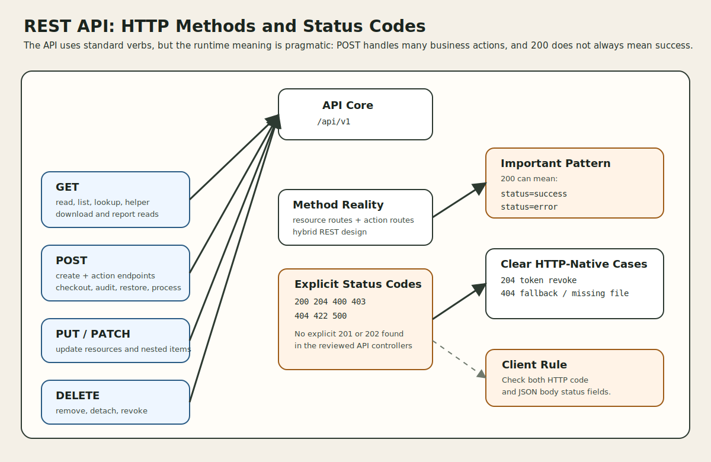

# REST API Integration: HTTP Methods and Status Codes

This document describes how HTTP methods and HTTP status codes are used in the REST API of this project. It is based on the actual `/api/v1` routes and API controllers, not on a generic REST style guide.

## 1. Why this view matters

When integrating with this API, the URL is only part of the contract.

Clients also need to know:

1. which HTTP method to use for each kind of endpoint
2. where the API follows CRUD conventions versus action-style POST routes
3. which status codes are explicitly used in controller code
4. when a `200` response still carries a business error in the body

## 2. HTTP methods used in `/api/v1`

The route file explicitly defines these methods:

| Method | Used in this API | Main role |
| --- | --- | --- |
| `GET` | Yes | read, list, search, lookup, relationship fetch, downloads, helpers |
| `POST` | Yes | create and business actions |
| `PUT` | Yes | update existing resources and nested child records |
| `PATCH` | Yes | partial-style update, especially hardware update |
| `DELETE` | Yes | delete resources, detach nested records, remove uploads, revoke tokens |

What is not explicitly defined in `routes/api.php`:

| Method | Observation |
| --- | --- |
| `HEAD` | not explicitly declared in the API route file |
| `OPTIONS` | not explicitly declared in the API route file |

## 3. Method design philosophy in this repo

The API uses a hybrid design:

- standard REST verbs for baseline resources
- explicit action endpoints for operational transitions such as checkout, checkin, audit, restore, import processing, and request cancellation

That means the method choice is pragmatic rather than REST-pure.

## 4. `GET` usage

`GET` is used for reads, lists, lookups, helpers, and some download-style operations.

### 4.1 Main `GET` endpoint families

| Family | Examples | Purpose |
| --- | --- | --- |
| collection reads | `/users`, `/hardware`, `/licenses` | list resources |
| item reads | `/users/{user}`, `/hardware/{id}` | read one resource |
| lookups | `/hardware/bytag/{any}`, `/hardware/byserial/{any}` | resolve by operational identifier |
| relationship reads | `/users/{user}/assets`, `/hardware/{asset}/assigned/components` | read linked records |
| helper reads | `/users/me`, `/locations/selectlist`, `/account/eulas` | support UI or integration workflows |
| reporting reads | `/reports/activity`, `/reports/depreciation` | read report data |
| operational reads | `/settings/backups`, `/settings/login-attempts` | admin or support inspection |
| file retrieval | `/{object_type}/{id}/files/{file_id}` | download or inline preview |
| version/info reads | `/version`, `/` fallback-style base response | platform metadata or route guidance |

### 4.2 `GET` design notes

| Observation | Meaning |
| --- | --- |
| `GET` is the dominant read method | standard resource access is read-friendly |
| some `GET` endpoints return JSON lists | typical list or detail payloads |
| some `GET` endpoints return files | success is not always JSON |
| some `GET` endpoints are helper-oriented rather than pure resources | `selectlist`, `me`, `requestable`, status helpers |

## 5. `POST` usage

`POST` is the most overloaded method in this API.

It is used for both resource creation and domain transitions.

### 5.1 `POST` as create

| Examples | Meaning |
| --- | --- |
| `POST /users` | create user |
| `POST /hardware` | create asset |
| `POST /imports` | upload import file |
| `POST /account/personal-access-tokens` | create personal access token |

### 5.2 `POST` as business action

| Examples | Meaning |
| --- | --- |
| `POST /hardware/{id}/checkout` | assign asset |
| `POST /hardware/{id}/checkin` | return asset |
| `POST /hardware/{asset}/audit` | record audit |
| `POST /hardware/{asset_id}/restore` | restore soft-deleted asset |
| `POST /account/request/{asset}` | create self-service request |
| `POST /account/request/{asset}/cancel` | cancel self-service request |
| `POST /imports/process/{import}` | process uploaded import |
| `POST /users/ldapsync` | run operational sync |
| `POST /users/two_factor_reset` | reset security state |
| `POST /hardware/labels` | generate label PDF payload |

### 5.3 Why `POST` is used so often

| Reason | Repo behavior |
| --- | --- |
| business transitions matter | checkout, checkin, audit, restore, cancel, process are modeled as named actions |
| some actions are not simple creates or updates | import processing and label generation are command-like |
| historical compatibility matters | some endpoints preserve older API patterns rather than forcing deeper REST normalization |

## 6. `PUT` and `PATCH` usage

The API uses both `PUT` and `PATCH`, but not uniformly across all resources.

### 6.1 `PATCH`

| Example | Meaning |
| --- | --- |
| `PATCH /hardware/{asset}` | update asset via `AssetsController@update` |

### 6.2 `PUT`

| Example | Meaning |
| --- | --- |
| `PUT /hardware/{asset}` | update asset via the same update action |
| `PUT /kits/{kit_id}/licenses/{license_id}` | update nested kit-license relation |
| `PUT /kits/{kit_id}/models/{model_id}` | update nested kit-model relation |
| `PUT /kits/{kit_id}/accessories/{accessory_id}` | update nested kit-accessory relation |
| `PUT /kits/{kit_id}/consumables/{consumable_id}` | update nested kit-consumable relation |

### 6.3 Update design notes

| Observation | Meaning |
| --- | --- |
| some resources rely on `Route::resource(...)` update conventions | standard controller update methods |
| hardware explicitly supports both `PUT` and `PATCH` | update compatibility is broader there |
| update responses are not always transformer-normalized | some legacy asset responses still return flatter model payloads |

## 7. `DELETE` usage

`DELETE` is used for destructive operations and detach-style nested removals.

| Endpoint family | Examples |
| --- | --- |
| resource delete | `/users/{user}`, `/hardware/{id}`, `/suppliers/{supplier}` |
| nested detach/delete | `/kits/{kit_id}/models/{model_id}`, `/kits/{kit_id}/licenses/{license_id}` |
| upload removal | `/{object_type}/{id}/files/{file_id}/delete` |
| token revocation | `/account/personal-access-tokens/{tokenId}` |

Design note:

- `DELETE` is used conservatively and usually maps to real removal, revocation, or detach semantics.

## 8. Explicit status codes observed in code

These status codes are explicitly visible in `routes/api.php` and the API controller code reviewed for this repo.

| Status code | Explicitly used | Typical meaning in this API |
| --- | --- | --- |
| `200 OK` | Yes | success, and sometimes business error |
| `204 No Content` | Yes | successful delete/revoke with empty body |
| `400 Bad Request` | Yes | operational request problem, test/config issue, or required request field missing in some custom actions |
| `403 Forbidden` | Yes | explicit authorization denial via `abort(403)` and policy/authorization checks |
| `404 Not Found` | Yes | unknown route, missing file, missing label asset set, missing token |
| `422 Unprocessable Entity` | Yes | validation or malformed input problems |
| `500 Internal Server Error` | Yes | unexpected failure, import failure, upload deletion failure, processing error |

Not explicitly observed in the route/controller code inspected for this doc:

| Status code | Observation |
| --- | --- |
| `201 Created` | not explicitly returned in the reviewed API controllers |
| `202 Accepted` | not explicitly returned in the reviewed API controllers |
| `401 Unauthorized` | not explicitly returned in the reviewed API controllers |
| `409 Conflict` | not explicitly returned in the reviewed API controllers |

## 9. `200 OK` behavior

`200` is the most important code to understand in this API, because it is used for both success and some business-error outcomes.

### 9.1 `200` as success

| Example behavior | Typical endpoints |
| --- | --- |
| normal create/update/delete success | most resource controllers |
| successful checkout/checkin/audit | action endpoints |
| successful restore | restore endpoints |
| successful admin test or operational action | some settings and user admin routes |

### 9.2 `200` as business error

Observed examples include:

| Pattern | Example meaning |
| --- | --- |
| `200` with `status: error` | asset not found in some legacy lookup or restore flows |
| `200` with `status: error` | validation/model save failure in some controllers |
| `200` with `status: error` | request/business rule failure instead of transport failure |

Design consequence:

- clients must inspect the response body, not just the transport code

## 10. `204 No Content`

`204` appears in the API token revoke path.

| Endpoint | Success behavior |
| --- | --- |
| `DELETE /api/v1/account/personal-access-tokens/{tokenId}` | returns empty body with `204` |

Related edge case:

| Case | Behavior |
| --- | --- |
| token not found | empty-body `404` |

This is one of the cleaner purely HTTP-native patterns in the API.

## 11. `400 Bad Request`

`400` appears mostly in operational or utility endpoints rather than standard CRUD.

Representative examples:

| Area | Example behavior |
| --- | --- |
| settings diagnostic/test routes | LDAP/mail test misconfiguration or invalid inputs |
| label generation | missing `asset_tags` in request body |

Design note:

- `400` is used where the controller treats the request as structurally wrong for that operation, not just a business-rule miss.

## 12. `403 Forbidden`

`403` is explicitly visible in the personal API token endpoints through `abort(403)`, and policy checks are used broadly across API controllers.

That means `403` should be treated as part of the real integration surface even when not every controller manually returns it.

| Source of `403` | Meaning |
| --- | --- |
| explicit `abort(403)` | direct capability denial |
| `$this->authorize(...)` and policy checks | framework-driven forbidden response when the caller lacks permission |

## 13. `404 Not Found`

`404` is used in a few distinct ways.

| `404` source | Meaning |
| --- | --- |
| `GET /api/v1/` base route | base API URL is not a usable business endpoint |
| API fallback route | unknown endpoint under `/api/v1` |
| file/download endpoints | requested file or backup not found |
| token revoke path | target token does not exist |
| label generation | no matching assets found for requested tags |

Design note:

- some missing-resource cases still use `200` plus `status: error`, so `404` is not the only “not found” pattern in the API

## 14. `422 Unprocessable Entity`

`422` is used where request validation or input structure fails more explicitly.

Representative cases:

| Area | Example behavior |
| --- | --- |
| notes API | missing required `note` |
| imports API | invalid file type, malformed encoding, duplicate headers, demo-mode feature disabled |
| categories API | invalid category type change |

Design note:

- `422` exists, but the API does not use it for every validation-like problem

## 15. `500 Internal Server Error`

`500` is used when the controller treats the condition as a real server-side failure.

Representative cases:

| Area | Example behavior |
| --- | --- |
| imports | processing failure, file handling failure, import error aggregation |
| notes | unexpected note persistence failure |
| uploaded files | deletion failure |
| users/settings | some operational reset/test failures |
| hardware labels | PDF generation or exception path |

Design note:

- import processing is one of the clearest examples where the API uses `500` for domain-processing failures rather than returning a softer `200` business error

## 16. Method-to-status-code relationship

The same method does not always imply the same status-code behavior.

| Method | Common status patterns in this repo |
| --- | --- |
| `GET` | `200`, `404`, sometimes binary success |
| `POST` | `200`, `400`, `422`, `500`, occasionally `404` for utility lookups |
| `PUT` / `PATCH` | often `200`, including some body-level business errors |
| `DELETE` | `200`, `204`, `404`, `500` depending on endpoint family |

Important implication:

- status-code meaning is endpoint-family-specific, not method-uniform

## 17. Practical integration rules

| Rule | Why it matters |
| --- | --- |
| use the route’s declared HTTP method exactly | many action endpoints are POST-only even when they “feel” like updates |
| do not treat `200` as automatic success | body inspection is required |
| support `204` empty responses | token revocation uses them |
| expect `403` from policy-gated endpoints | authorization is pervasive in controllers |
| treat `422` as a stronger validation signal, not the only one | some validation-like issues still return `200` or `400` |
| treat `404` as only one of several missing-resource patterns | some not-found cases are body-level errors with `200` |
| handle binary success responses separately from JSON success responses | file retrieval endpoints do this |

## 18. Design observations

| Observation | Meaning |
| --- | --- |
| Methods are readable and explicit | the route surface is easy to reason about operationally |
| POST is heavily action-oriented | business verbs are first-class |
| Status-code discipline is pragmatic, not strict | real-world compatibility and legacy behavior shape the API |
| Body-level status is part of the protocol | JSON status fields matter almost as much as HTTP status codes |
| The API mixes older and newer patterns | cleaner HTTP-native flows exist beside legacy `200` error flows |

## 19. Source of truth

- `routes/api.php`
- `app/Http/Controllers/Api/AssetsController.php`
- `app/Http/Controllers/Api/CategoriesController.php`
- `app/Http/Controllers/Api/ImportController.php`
- `app/Http/Controllers/Api/NotesController.php`
- `app/Http/Controllers/Api/ProfileController.php`
- `app/Http/Controllers/Api/SettingsController.php`
- `app/Http/Controllers/Api/UploadedFilesController.php`
- `app/Http/Controllers/Api/UsersController.php`
- `app/Http/Controllers/Api/ManufacturersController.php`
- `app/Http/Controllers/Api/LicenseSeatsController.php`
