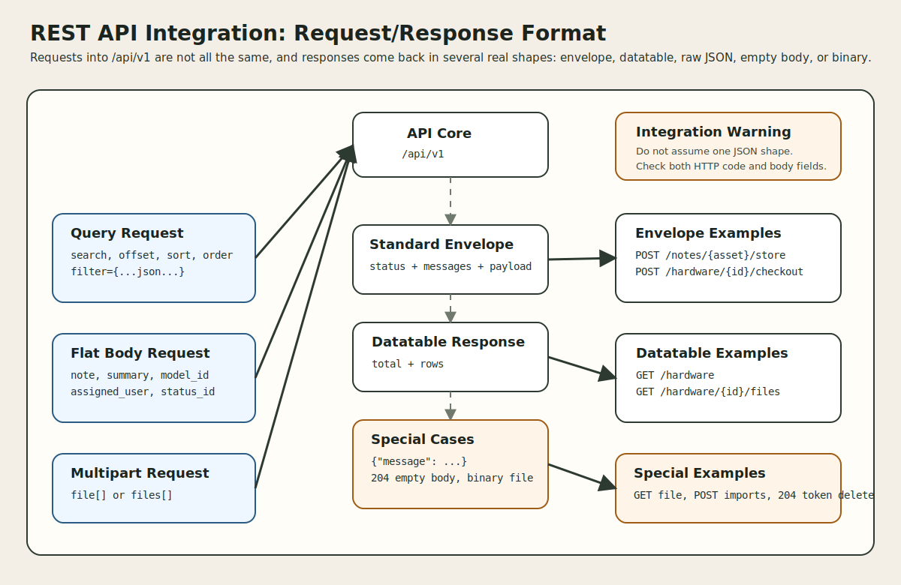

# REST API Integration: Request/Response Format

This document describes how requests and responses are formatted in the REST API of this project. It focuses on the actual `/api/v1` behavior in the codebase: query-string list requests, flat action bodies, multipart upload requests, the standard JSON envelope, datatable-style list payloads, and the important exceptions to those patterns.



## 1. Why this matters

The route design tells you where to call.

This document answers the next integration question:

1. What should the client send?
2. What shape should the client expect back?
3. Which endpoints return the standard envelope, and which do not?
4. Where do transport-level status codes and body-level statuses diverge?

## 2. High-level request format

The API does not force a single request payload style for every endpoint.

Instead, the request format depends on the endpoint family.

| Request style | Where it appears | Typical shape |
| --- | --- | --- |
| path parameters | item, action, relationship, nested routes | `/hardware/{id}`, `/users/{user}/assets` |
| query string | list and search endpoints | `?search=...&sort=...&order=...&offset=...` |
| flat form or JSON body | create, update, and action routes | key-value fields such as `summary`, `note`, `assigned_user` |
| multipart form-data | file uploads and CSV imports | file arrays plus optional metadata fields |
| array-valued body fields | special utility endpoints | `asset_tags: [...]`, `column-mappings: {...}` |

Design observation:

- Most write endpoints expect flat field names, not deeply nested JSON DTOs.
- The API is Laravel-form friendly, so many handlers are happy with either JSON bodies or standard form-style request bodies, as long as the fields match what the controller or FormRequest expects.

## 3. Common request components

### 3.1 Path parameters

| Pattern | Examples | Notes |
| --- | --- | --- |
| numeric or bound item ID | `/users/{user}`, `/hardware/{asset}` | mixed route-model binding and raw IDs |
| action target | `/hardware/{id}/checkout`, `/users/{user}/restore` | item plus transition verb |
| operational lookup key | `/hardware/bytag/{any}`, `/hardware/byserial/{any}` | wildcard route values can contain non-trivial strings |
| generic typed object | `/{object_type}/{id}/files` | object type is constrained by route regex |

### 3.2 Query string

List-style endpoints commonly use:

| Query parameter | Typical meaning | Seen in |
| --- | --- | --- |
| `search` | free-text search | assets, users, uploaded files, requestable assets |
| `offset` | pagination offset | assets, uploaded files, relationship lists |
| `sort` | requested sort column | assets, users, uploaded files |
| `order` | sort direction, usually `asc` or `desc` | assets, users, uploaded files |
| `filter` | JSON-encoded filter object | assets, users |

Resource-specific exact-match query fields also appear, especially on list endpoints. Examples from `UsersController` include `activated`, `company_id`, `location_id`, `email`, `username`, `first_name`, `last_name`, and others.

### 3.3 Body fields

Body fields are usually flat:

| Body style | Example |
| --- | --- |
| simple action body | `note=Returned to stock` |
| assignment body | `assigned_user=7`, `checkout_to_type=user` |
| token-creation body | `name=Automation Token` |
| resource create/update body | `model_id`, `status_id`, `asset_tag`, `serial`, `purchase_cost`, custom field columns |

## 4. Query/list request format

Many collection endpoints behave like searchable datatable APIs.

### 4.1 Common list query example

```http
GET /api/v1/hardware?search=laptop&sort=name&order=asc&offset=0
```

### 4.2 Filter query example

The `filter` field is not a nested query tree. It is a JSON string validated by `FilterRequest`.

```http
GET /api/v1/users?filter={"company_id":1,"location_id":3}
```

Important behavior:

| Rule | Meaning |
| --- | --- |
| `filter` must be valid JSON | invalid JSON is rejected by the request validator |
| not every field is accepted | controllers whitelist allowed filter/sort columns |
| `offset` and `limit` are normalized internally | clients should still send sane numeric values |
| `search` usually acts as a fallback to structured filter | if no valid structured filter is present |

## 5. Request format by endpoint family

### 5.1 Resource create and update

Create and update endpoints usually take a flat body whose keys match model or request-validation fields.

Representative example:

| Endpoint | Request format characteristics |
| --- | --- |
| `POST /api/v1/hardware` | flat asset fields, validated by `StoreAssetRequest`, may include assignment helpers and image input |
| `PATCH /api/v1/hardware/{asset}` | partial flat update, validated by `UpdateAssetRequest` |
| `POST /api/v1/users` | flat user fields |
| `PUT /api/v1/licenses/{license}` | flat update fields |

Notable hardware-specific behavior:

| Field pattern | Meaning |
| --- | --- |
| `assigned_user`, `assigned_asset`, `assigned_location` | assignment shortcut fields used during create or update |
| `image_source` | legacy input name for encoded image uploads |
| custom field column names | dynamic fields can be submitted directly as flat keys |

### 5.2 Action endpoints

These routes usually accept a compact flat body tailored to the business transition.

#### Asset checkout example

`AssetCheckoutRequest` validates fields like:

| Field | Meaning |
| --- | --- |
| `assigned_user` | target user ID |
| `assigned_asset` | target asset ID |
| `assigned_location` | target location ID |
| `checkout_to_type` | one of `asset`, `location`, `user` |
| `status_id` | deployable status label ID |
| `checkout_at` | optional checkout timestamp |
| `expected_checkin` | optional expected return date |
| `note` | optional or required depending on settings |

Representative call:

```json
{
  "assigned_user": 7,
  "checkout_to_type": "user",
  "status_id": 2,
  "expected_checkin": "2026-06-30",
  "note": "Issued to support staff"
}
```

#### Note creation example

`POST /api/v1/notes/{asset}/store`

```json
{
  "note": "Device inspected and cleaned"
}
```

#### Personal access token example

`POST /api/v1/account/personal-access-tokens`

```json
{
  "name": "Automation Token"
}
```

### 5.3 Multipart file upload

Attachment uploads use `multipart/form-data`.

| Endpoint | Required fields | Optional fields |
| --- | --- | --- |
| `POST /api/v1/{object_type}/{id}/files` | `file[]` | `notes` |

Validation detail from `UploadFileRequest`:

| Rule | Meaning |
| --- | --- |
| `file.*` required | each uploaded element must exist |
| MIME/extension validation | enforced against configured allowed upload extensions |
| max size validation | enforced against the server-side upload limit helper |

Representative multipart shape:

```text
file[]: screenshot.png
file[]: warranty.pdf
notes: Evidence captured during audit
```

### 5.4 Multipart import upload

Import creation also uses multipart upload.

| Endpoint | Expected upload field | Notes |
| --- | --- | --- |
| `POST /api/v1/imports` | `files[]` | CSV files only |

Important import-upload behavior:

| Behavior | Meaning |
| --- | --- |
| MIME type must look like CSV | otherwise `422` error response |
| file encoding is inspected | non-UTF-8 content may be transliterated |
| duplicate headers are rejected | import store can fail before persistence |
| response returns preview metadata | includes header row and first-row sample |

### 5.5 Import processing request

The second import step is a normal body request, not another file upload.

| Field | Meaning |
| --- | --- |
| `import-type` | required import domain such as `asset`, `user`, `location` |
| `column-mappings` | mapping of CSV headers to target fields |
| `import-update` | update-existing behavior toggle |
| `send-welcome` | notify behavior toggle |
| `run-backup` | optional pre-import backup toggle |

### 5.6 Array utility request

Some utility endpoints expect arrays rather than scalar form fields.

Representative example:

| Endpoint | Field | Meaning |
| --- | --- | --- |
| `POST /api/v1/hardware/labels` | `asset_tags` | array of asset tags to turn into a label PDF |

## 6. Standard JSON response envelope

Most CRUD and action endpoints use `Helper::formatStandardApiResponse(...)`.

That produces this shape:

| Field | Meaning |
| --- | --- |
| `status` | outcome label |
| `messages` | string, array, or `null` |
| `payload` | data object, list, or `null` |

Example:

```json
{
  "status": "success",
  "messages": "Operation completed.",
  "payload": {
    "id": 123
  }
}
```

Important detail:

| Field nuance | Meaning |
| --- | --- |
| `messages` may be a string | common success or business-error case |
| `messages` may be an array/object | validation-style detail or grouped import errors |
| `payload` may be `null` | for pure acknowledgement responses |

## 7. Common response families

### 7.1 Envelope around a single object or action result

| Typical endpoint | Response pattern |
| --- | --- |
| `POST /hardware/{id}/checkout` | standard envelope with a compact payload like asset tag info |
| `POST /notes/{asset}/store` | standard envelope with stored note details |
| `POST /account/personal-access-tokens` | standard envelope with token details |
| `POST /hardware/labels` | standard envelope with `payload.pdf` base64 content |

### 7.2 Datatable-style list payload

Many list responses are returned through `DatatablesTransformer`.

That shape is:

| Field | Meaning |
| --- | --- |
| `total` | total matching rows before pagination |
| `rows` | current page of returned records |

Example:

```json
{
  "total": 245,
  "rows": [
    {
      "id": 1,
      "name": "Laptop A"
    }
  ]
}
```

Seen in endpoints backed by transformers such as:

| Endpoint family | Example |
| --- | --- |
| assets lists | `/api/v1/hardware` |
| requestable assets | `/api/v1/account/requestable/hardware` |
| uploaded files lists | `/api/v1/hardware/{id}/files` |
| assigned relationship lists | `/api/v1/hardware/{asset}/assigned/assets` |

### 7.3 Bare arrays or wrapper objects

Not every successful JSON response uses the standard envelope.

| Endpoint | Response shape |
| --- | --- |
| `GET /api/v1/imports` | bare array of transformed imports |
| `POST /api/v1/imports` | `{ "files": [...] }` |
| `GET /api/v1/version` | raw version object |

### 7.4 Plain message object

Some operational endpoints return a very simple response:

```json
{
  "message": "Mail sent to support@example.com"
}
```

This style appears in some settings/admin API actions instead of the shared envelope.

### 7.5 Empty-body responses

Some endpoints deliberately return no JSON body.

| Endpoint | Success response |
| --- | --- |
| `DELETE /api/v1/account/personal-access-tokens/{tokenId}` | HTTP `204 No Content` |

Related nuance:

| Case | Behavior |
| --- | --- |
| token not found | empty-body `404` response |
| token deleted | empty-body `204` response |

### 7.6 Binary or streamed responses

Not every successful response is JSON.

| Endpoint | Success response |
| --- | --- |
| `GET /api/v1/{object_type}/{id}/files/{file_id}` | streamed or downloaded file |

Special query behavior:

| Query | Effect |
| --- | --- |
| `?inline=true` | returns an inline content-disposition response when allowed |

If the object or file is invalid, the same endpoint can return JSON error payloads instead.

## 8. Important response inconsistencies

These are not bugs in the doc. They are real integration details visible in the code.

| Inconsistency | What it means |
| --- | --- |
| helper uses `messages`, route fallback uses `message` | client code should not assume one field name for every error body |
| some list endpoints use `total` + `rows` without envelope | list consumers need a different parser than action consumers |
| asset create/update return legacy flat model payloads | not every resource payload is transformer-shaped |
| some operational endpoints return `{ "message": ... }` | message-only responses exist beside envelope responses |
| file download endpoints may return binary instead of JSON | content-type can vary by success path |

The `AssetsController` even contains comments explaining that some create/update returns remain legacy-shaped for compatibility with existing clients.

## 9. HTTP status-code behavior

The transport status code matters, but it is not the whole story in this API.

| Status code pattern | Meaning |
| --- | --- |
| `200` with `status: success` | common success path |
| `200` with `status: error` | business failure represented in the body |
| `204` empty body | successful delete/no-content path |
| `400` | some operational validation failures |
| `403` | authorization abort in some endpoints |
| `404` | fallback route, missing files, or not-found routes |
| `422` | request validation or malformed upload/input problems |
| `500` | import processing failures or unexpected server-side errors |

Important statuses visible in body payloads:

| Body `status` value | Where it appears |
| --- | --- |
| `success` | most successful envelope responses |
| `error` | most business or validation-style failures |
| `warning` | some import delete outcomes |
| `import-errors` | import processing failure path |

## 10. Practical integration examples

### 10.1 Successful action response

```json
{
  "status": "success",
  "messages": "Note added.",
  "payload": {
    "note": "Device inspected and cleaned",
    "item_id": 15
  }
}
```

### 10.2 Validation-style response

```json
{
  "status": "error",
  "messages": "The note field is required.",
  "payload": null
}
```

### 10.3 Datatable-style list response

```json
{
  "total": 2,
  "rows": [
    {
      "id": 10,
      "filename": "warranty.pdf"
    },
    {
      "id": 11,
      "filename": "photo.jpg"
    }
  ]
}
```

### 10.4 Import upload response

```json
{
  "files": [
    {
      "id": 4,
      "file_path": "2026-06-03-assets.csv",
      "header_row": ["asset_tag", "name"],
      "first_row": ["LT-001", "Laptop A"]
    }
  ]
}
```

## 11. Integration guidance

| Guidance | Why it matters |
| --- | --- |
| inspect both HTTP status and response body | some business failures still return `200` |
| support more than one JSON shape | envelope, datatable, raw object, raw array, and message-only responses all exist |
| treat `filter` as a JSON string in query params | that is what the validator expects |
| use multipart form-data for uploads and imports | those endpoints read uploaded files directly |
| expect flat write payloads | most create/update/action bodies are key-value rather than nested objects |
| do not assume transformer output everywhere | some legacy create/update responses still return flatter model data |
| be ready for binary download responses | especially file retrieval endpoints |

## 12. Source of truth

- `routes/api.php`
- `app/Helpers/Helper.php`
- `app/Http/Requests/FilterRequest.php`
- `app/Http/Requests/AssetCheckoutRequest.php`
- `app/Http/Requests/UploadFileRequest.php`
- `app/Http/Requests/ItemImportRequest.php`
- `app/Http/Requests/StoreAssetRequest.php`
- `app/Http/Requests/UpdateAssetRequest.php`
- `app/Http/Controllers/Api/AssetsController.php`
- `app/Http/Controllers/Api/NotesController.php`
- `app/Http/Controllers/Api/UploadedFilesController.php`
- `app/Http/Controllers/Api/ImportController.php`
- `app/Http/Controllers/Api/ProfileController.php`
- `app/Http/Transformers/DatatablesTransformer.php`
- `app/Http/Transformers/AssetsTransformer.php`
- `app/Http/Transformers/UploadedFilesTransformer.php`
- `app/Http/Transformers/ImportsTransformer.php`
