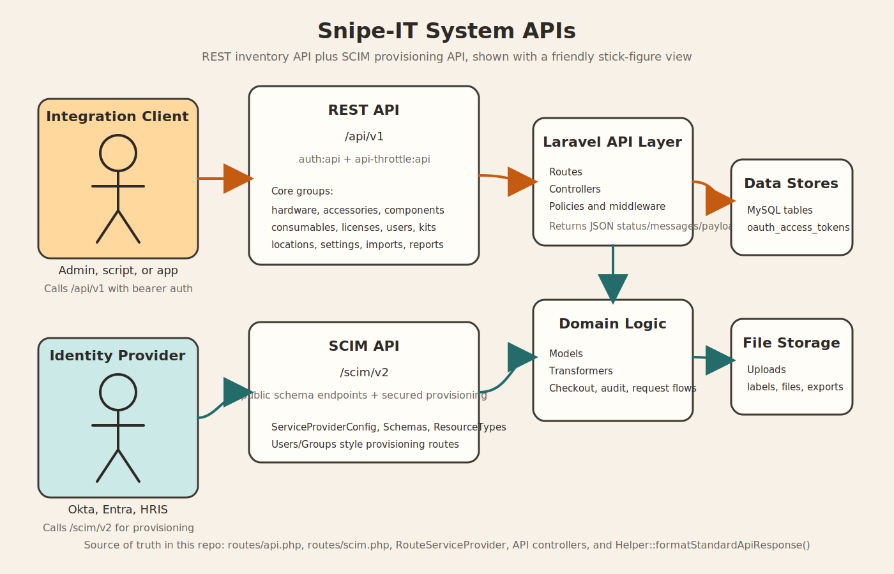

# System APIs

This document summarizes the API surface exposed by this Snipe-IT project, based on the route and controller code in `routes/api.php`, `routes/scim.php`, `app/Providers/RouteServiceProvider.php`, and the API controllers under `app/Http/Controllers/Api`.



## 1. What the system exposes

The project exposes two main API families:

| API family | Base path | Main purpose |
| --- | --- | --- |
| REST API | `/api/v1` | Asset management, inventory operations, admin settings, reports, imports, labels, notes, and file attachments |
| SCIM API | `/scim/v2` | Identity provisioning and schema discovery for external identity providers |

## 2. Security and access model

### REST API

- Routes are registered under `/api` in `RouteServiceProvider`, then versioned again under `/v1` in `routes/api.php`.
- The REST API is protected by `auth:api`.
- The `/api/v1` routes also run through the `api` middleware group and `api-throttle:api`.
- Rate limiting is configured in `RouteServiceProvider` using `config('app.api_throttle_per_minute')`.
- Personal access token support is provided by Laravel Passport.

### SCIM API

- Public SCIM discovery routes are available without the secured SCIM middleware wrapper.
- Private SCIM provisioning routes are protected by `auth:api` and `authorize:superadmin`.
- SCIM support is supplied by the installed `arietimmerman/laravel-scim-server` package.

## 3. Common response shape

Most action-oriented API responses use the same envelope:

```json
{
  "status": "success",
  "messages": "Human-readable message",
  "payload": {}
}
```

This comes from `Helper::formatStandardApiResponse()`.

List-style endpoints often return table-like payloads such as:

```json
{
  "total": 42,
  "rows": []
}
```

Note for integrators:
Some controllers return business errors inside the JSON body with `"status": "error"` while still using HTTP `200`. Clients should check both the HTTP status code and the JSON `status` field.

## 4. REST API structure

### 4.1 Account and self-service

Base path: `/api/v1/account`

- `GET /requests`
- `GET /eulas`
- `POST /request/{asset}`
- `POST /request/{asset}/cancel`
- `GET /requestable/hardware`
- `GET /personal-access-tokens`
- `POST /personal-access-tokens`
- `DELETE /personal-access-tokens/{tokenId}`

Purpose:
Self-service asset requests, accepted EULAs, and API token management.

### 4.2 Core inventory resources

These resources follow the usual REST pattern:

- `GET /{resource}` for list
- `POST /{resource}` for create
- `GET /{resource}/{id}` for detail
- `PUT` or `PATCH /{resource}/{id}` for update
- `DELETE /{resource}/{id}` for delete

Main resource collections:

- `/api/v1/hardware`
- `/api/v1/accessories`
- `/api/v1/components`
- `/api/v1/consumables`
- `/api/v1/licenses`
- `/api/v1/maintenances`
- `/api/v1/kits`

Notable operational endpoints:

| Area | Example endpoints | Purpose |
| --- | --- | --- |
| Hardware | `GET /hardware/bytag/{tag}`, `GET /hardware/byserial/{any}` | Resolve assets by tag or serial |
| Hardware | `POST /hardware/{id}/checkout`, `POST /hardware/{id}/checkin` | Asset circulation |
| Hardware | `POST /hardware/{asset}/audit` | Audit recording |
| Hardware | `GET /hardware/{asset}/assigned/assets` | Show downstream assignments |
| Hardware | `POST /hardware/{asset_id}/restore` | Restore soft-deleted asset |
| Hardware | `POST /hardware/labels` | Generate asset labels |
| Accessories | `POST /accessories/{accessory}/checkout`, `POST /accessories/{accessory}/checkin` | Accessory circulation |
| Accessories | `GET /accessories/{accessory}/checkedout` | See checked out accessory rows |
| Components | `POST /components/{id}/checkout`, `POST /components/{id}/checkin` | Component quantity assignment |
| Components | `GET /components/{component}/assets` | List assets using a component |
| Consumables | `POST /consumables/{consumable}/checkout` | Issue consumables |
| Consumables | `GET /consumables/{id}/users` | See who received them |
| Licenses | `GET /licenses/selectlist` | Lightweight selection lookup |
| License seats | Nested `licenses.seats` resource | Per-seat read and update operations |
| Kits | `/kits/{kit_id}/licenses`, `/models`, `/accessories`, `/consumables` | Compose reusable checkout kits |

### 4.3 Reference and admin data

REST resources are exposed for:

- `/api/v1/categories`
- `/api/v1/companies`
- `/api/v1/departments`
- `/api/v1/depreciations`
- `/api/v1/fields`
- `/api/v1/fieldsets`
- `/api/v1/groups`
- `/api/v1/locations`
- `/api/v1/manufacturers`
- `/api/v1/models`
- `/api/v1/statuslabels`
- `/api/v1/suppliers`
- `/api/v1/users`
- `/api/v1/settings`
- `/api/v1/imports`

Helpful supporting endpoints:

| Area | Example endpoints | Purpose |
| --- | --- | --- |
| Categories | `GET /categories/{item_type}/selectlist` | Item-type-specific options |
| Locations | `GET /locations/{location}/users`, `GET /locations/{location}/assets` | Location detail views |
| Manufacturers | `POST /manufacturers/{id}/restore` | Restore archived manufacturer |
| Models | `GET /models/assets`, `POST /models/{id}/restore` | Model-level asset lookup and restore |
| Fields | `POST /fields/{field}/associate`, `POST /fields/{field}/disassociate` | Custom field relationship management |
| Fieldsets | `POST /fieldsets/{fieldset}/fields` | Resolve fieldset field membership |
| Users | `GET /users/me` | Current authenticated user |
| Users | `POST /users/ldapsync`, `POST /users/two_factor_reset` | Identity administration |
| Users | `GET /users/{user}/assets`, `/accessories`, `/licenses` | User-assigned inventory |
| Users | `POST /users/{user}/restore` | Restore archived user |
| Settings | `GET /settings/backups`, `GET /settings/backups/download/latest` | Backup management |
| Settings | `GET /settings/ldaptest`, `POST /settings/mailtest`, `POST /settings/slacktest` | Integration diagnostics |
| Imports | `POST /imports/process/{import}` | Start import processing |

### 4.4 Reporting, notes, labels, and files

| Capability | Endpoints | Purpose |
| --- | --- | --- |
| Reports | `GET /reports/activity`, `GET /reports/depreciation` | Reporting feeds |
| Notes | `GET /notes/{asset}/index`, `POST /notes/{asset}/store` | Asset note history |
| Labels | `GET /labels`, `GET /labels/{name}` | Label definitions and retrieval |
| Version | `GET /version` | App, build, and hash version info |
| Files | `GET /{object_type}/{id}/files` | List attachments |
| Files | `GET /{object_type}/{id}/files/{file_id}` | Download or inspect an attachment |
| Files | `POST /{object_type}/{id}/files` | Upload attachments |
| Files | `DELETE /{object_type}/{id}/files/{file_id}/delete` | Remove attachments |

Supported file attachment object types:

- `accessories`
- `audits`
- `assets`
- `components`
- `consumables`
- `hardware`
- `licenses`
- `locations`
- `maintenances`
- `models`
- `suppliers`
- `users`

## 5. SCIM API structure

### 5.1 Public discovery endpoints

- `GET /scim/v2/ServiceProviderConfig`
- `GET /scim/v2/Schemas`
- `GET /scim/v2/Schemas/{id}`
- `GET /scim/v2/ResourceTypes`
- `GET /scim/v2/ResourceTypes/{id}`

### 5.2 Secured provisioning endpoints

- `GET /scim/v2/{resourceType}`
- `POST /scim/v2/{resourceType}`
- `GET /scim/v2/{resourceType}/{resourceObject}`
- `PUT /scim/v2/{resourceType}/{resourceObject}`
- `PATCH /scim/v2/{resourceType}/{resourceObject}`
- `DELETE /scim/v2/{resourceType}/{resourceObject}`

### 5.3 Current-user SCIM endpoints

- `GET /scim/v2/Me`
- `PUT /scim/v2/Me`
- `POST /scim/v2/Me`

Purpose:
This gives the system an identity-provisioning surface for external IdPs while keeping the actual business inventory operations in `/api/v1`.

## 6. Typical request flow

1. A client authenticates with an API token handled by Passport-backed `auth:api`.
2. The request enters `/api/v1` or `/scim/v2`.
3. Route middleware enforces auth, throttling, and permission rules.
4. An API controller loads domain models, policies, transformers, and related services.
5. The controller returns JSON, most often using the standard `{status, messages, payload}` envelope.

## 7. Source of truth

If this document needs to be refreshed later, these files are the best starting points:

- `routes/api.php`
- `routes/scim.php`
- `app/Providers/RouteServiceProvider.php`
- `app/Http/Kernel.php`
- `app/Helpers/Helper.php`
- `app/Http/Controllers/Api/ProfileController.php`

