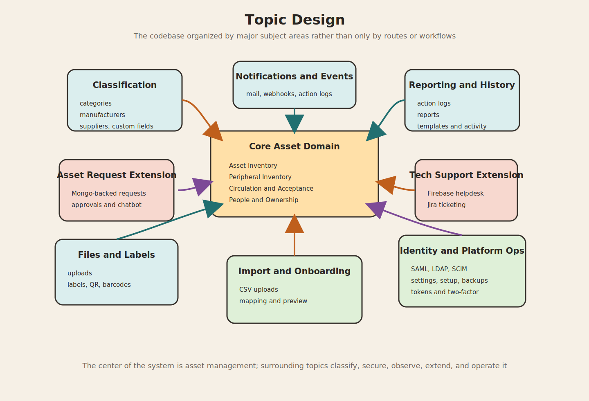

# Topic Design

This document describes the topic design of the project: the major subject areas the system is organized around, what each topic owns, and how the topics connect.

For this document, "topic" means a meaningful domain or cross-cutting concern in the codebase, similar to a bounded context or functional area.

## 1. Why this view matters

The other docs answer different questions:

- `system-apis.md`: what interfaces exist
- `process-apis.md`: how work moves
- `experience-apis.md`: how users experience the product
- `event-catalog.md`: what events are emitted or persisted

This topic design view answers:

1. What is the project "about" at a domain level?
2. Which code areas belong together?
3. What are the core topics versus the support topics?
4. Where do custom extensions sit compared with stock Snipe-IT concerns?

## 2. Topic map

| Topic | Role in the system | Core models/services | Main interfaces |
| --- | --- | --- | --- |
| Asset Inventory | Tracks hardware as the central managed object | `Asset`, `AssetModel`, `Statuslabel`, `Maintenance` | Web hardware routes, REST hardware routes, reports |
| Peripheral Inventory | Tracks non-hardware inventory such as accessories, components, consumables, and licenses | `Accessory`, `AccessoryCheckout`, `Component`, `Consumable`, `ConsumableAssignment`, `License`, `LicenseSeat`, `PredefinedKit`, `PredefinedKitCheckoutService` | Web inventory routes, REST inventory routes, kit flows |
| People and Ownership | Represents who uses, owns, approves, receives, and administers items | `User`, `Department`, `Group`, `Company`, `Location` | User management, account pages, assignment flows, manager view |
| Circulation and Acceptance | Governs checkout, checkin, return, request, and acceptance behavior | `CheckoutRequest`, `CheckoutAcceptance`, `Checkoutable`, `Acceptable`, `Requestable` | Checkout/checkin endpoints, request flows, acceptance pages |
| Classification and Metadata | Describes how inventory is categorized and extended | `Category`, `Manufacturer`, `Supplier`, `Depreciation`, `CustomField`, `CustomFieldset` | Admin CRUD, import mapping, model custom fields |
| Reporting and History | Turns operational data into audit trails, reports, and templates | `Actionlog`, `ReportTemplate`, `Loggable` | Reports UI, report APIs, event log history, activity views |
| Files, Labels, and Output | Produces printable, downloadable, or attached artifacts | Label models under `app/Models/Labels`, `HasUploads`, `UploadedFilesController` | File upload/download, labels, QR/barcodes, printed inventory |
| Identity and Access | Handles sign-in, federation, SCIM, tokens, and security settings | `Ldap`, `SamlNonce`, `SCIMUser`, `SnipeSCIMConfig`, `Saml` service | Login, SAML, LDAP, SCIM, API token pages, two-factor flows |
| Configuration and Platform Ops | Controls system-wide behavior and operational administration | `Setting`, backup flows, admin settings logic | `/admin/*`, setup, backup UI, notification settings |
| Import and Data Onboarding | Ingests external data into the system | `Import`, importer classes, `Importer` Livewire | `/import`, `/api/v1/imports`, CSV mapping and processing |
| Asset Request Extension | Adds a custom request-and-approval topic beyond stock inventory assignment | `AssetRequestMongoService`, `AssetRequestApproverMongoService`, `AssetRequestTechnicalSupportMongoService`, `AssetChatbotService`, `OllamaService` | `/assetRequest/*`, chatbot, approver assignment, asset specification |
| Tech Support Extension | Adds a custom support-ticketing topic tied to Firebase and Jira | `FirebaseHelpdeskService`, `JiraIssueService` | `/tech-support/*`, approval, diagnostics, resolution |
| Notifications and Eventing | Connects actions to communication and history | event classes, listeners, notification classes | mail, webhooks, Teams/Slack/Google Chat, action logs |

## 3. Topic ownership table

| Topic | What it owns | What it does not own |
| --- | --- | --- |
| Asset Inventory | Hardware lifecycle, audit readiness, asset lookup, assignment state | Approval policy for custom asset requests, support tickets |
| Peripheral Inventory | Accessory/component/consumable/license tracking and issue flows | Primary login/identity concerns |
| People and Ownership | User profiles, assigned inventory, organizational attachment | Label rendering, import parsing |
| Circulation and Acceptance | Transfer verbs and acceptance outcomes | Full user experience rendering, admin branding |
| Classification and Metadata | Category and attribute meaning, field extensibility | Runtime notification delivery |
| Reporting and History | Historical traceability, templates, exports, log presentation | Direct ownership of core inventory records |
| Files, Labels, and Output | Attachments, labels, printable artifacts, download views | Authentication and authorization policy definition |
| Identity and Access | Authentication methods, token issuance, federation hooks, SCIM | Asset audit and import business logic |
| Configuration and Platform Ops | Global settings, backups, setup, integration switches | Day-to-day checkout and checkin state |
| Import and Data Onboarding | CSV upload, preview, mapping, processing | Normal user-facing self-service flows |
| Asset Request Extension | Multi-step request approval and deployment flow | Baseline Snipe-IT hardware checkout semantics |
| Tech Support Extension | Ticket lifecycle across Firebase and Jira | Core asset model lifecycle |
| Notifications and Eventing | Side effects, comms, logging, webhook delivery | Direct UI ownership |

## 4. Core topic clusters

### 4.1 Core asset management cluster

These are the topics closest to the original product center:

- Asset Inventory
- Peripheral Inventory
- People and Ownership
- Circulation and Acceptance
- Classification and Metadata

Why they matter:
These topics form the operational core of the product. If this cluster disappeared, the project would no longer be an inventory and asset-management system.

### 4.2 Control and observability cluster

- Reporting and History
- Files, Labels, and Output
- Notifications and Eventing

Why they matter:
These topics make the core system governable, auditable, communicative, and usable at scale.

### 4.3 Platform and administration cluster

- Identity and Access
- Configuration and Platform Ops
- Import and Data Onboarding

Why they matter:
These topics make the system installable, configurable, secure, and maintainable in production environments.

### 4.4 Custom business-extension cluster

- Asset Request Extension
- Tech Support Extension

Why they matter:
These are the clearest project-specific extensions beyond stock Snipe-IT-style asset tracking. They introduce external-service-backed workflows and enrich the product with internal request and support capabilities.

## 5. Topic relationships

| From topic | To topic | Relationship |
| --- | --- | --- |
| Asset Inventory | People and Ownership | Assets are assigned to people, locations, or other assets |
| Asset Inventory | Classification and Metadata | Assets depend on models, categories, manufacturers, suppliers, depreciation, and custom fields |
| Asset Inventory | Reporting and History | Asset actions generate audit logs, reports, and metrics |
| Peripheral Inventory | Circulation and Acceptance | Accessories, components, consumables, and license seats use checkout and checkin semantics |
| People and Ownership | Identity and Access | Users are both domain actors and auth principals |
| Circulation and Acceptance | Notifications and Eventing | Checkout, checkin, acceptance, and decline actions emit events and notifications |
| Reporting and History | Notifications and Eventing | Action logs and notifications together explain "what happened" |
| Files, Labels, and Output | Asset Inventory | Labels, attachments, QR codes, and barcodes are generated for inventory objects |
| Import and Data Onboarding | Core inventory topics | Imports populate assets, users, models, suppliers, categories, and more |
| Configuration and Platform Ops | All topics | Settings influence behavior across auth, UI, notifications, reporting, and workflows |
| Asset Request Extension | People and Ownership | Employees, approvers, and support staff all participate in the request topic |
| Asset Request Extension | Asset Inventory | Approved requests eventually map back to deployed asset decisions |
| Tech Support Extension | People and Ownership | Tickets are created, approved, tracked, and resolved by users in different roles |
| Tech Support Extension | Notifications and Eventing | Ticket progress depends on external-system communication and status changes |
| Identity and Access | Experience APIs | Login, SAML, LDAP, Google auth, SCIM, and API keys shape the user experience layer |

## 6. Topic design observations

| Observation | Meaning |
| --- | --- |
| The project has a strong core domain | Inventory, circulation, people, and classification are the center of gravity |
| The project also has strong cross-cutting infrastructure topics | Auth, settings, reporting, uploads, labels, imports, and notifications are first-class concerns |
| Custom extensions are clearly visible | Asset requests and tech support are distinct product topics, not just small helpers |
| Eventing is narrow but meaningful | Runtime events are focused, while `Actionlog` broadens the event history topic |
| Experience flows cross multiple topics | Most user journeys span at least inventory, people, auth, and history |
| Topic boundaries are code-visible | Models, route files, controllers, services, listeners, and Livewire components align reasonably well with topic groupings |

## 7. Suggested way to read the codebase by topic

| If you want to understand... | Start here |
| --- | --- |
| Hardware and assignment | `Asset`, `AssetsController`, `routes/web/hardware.php`, `routes/api.php` |
| Non-hardware inventory | `Accessory`, `Component`, `Consumable`, `License`, their controllers and route files |
| Requests and acceptance | `CheckoutRequest`, `CheckoutAcceptance`, `ViewAssetsController`, `AcceptanceController`, `CheckoutRequest` API controller |
| User ownership and self-service | `User`, `ProfileController`, `ViewAssetsController`, `routes/web.php` account routes |
| History and audit | `Actionlog`, `Loggable`, `LogListener`, reports controllers |
| Admin configuration | `Setting`, `SettingsController`, setup and auth controllers |
| Imports | `Import`, importer classes, `App\Livewire\Importer`, import controllers |
| Custom asset request feature | `AssetRequestController`, Mongo services, chatbot service |
| Tech support feature | `TechSupportController`, Firebase and Jira services |

## 8. Source of truth

- `app/Models/*`
- `app/Models/Traits/*`
- `app/Services/*`
- `routes/web.php`
- `routes/web/*.php`
- `routes/api.php`
- `app/Http/Controllers/*`
- `app/Http/Controllers/Account/*`
- `app/Livewire/*`
- `app/Notifications/*`
- `app/Events/*`
- `app/Listeners/*`

